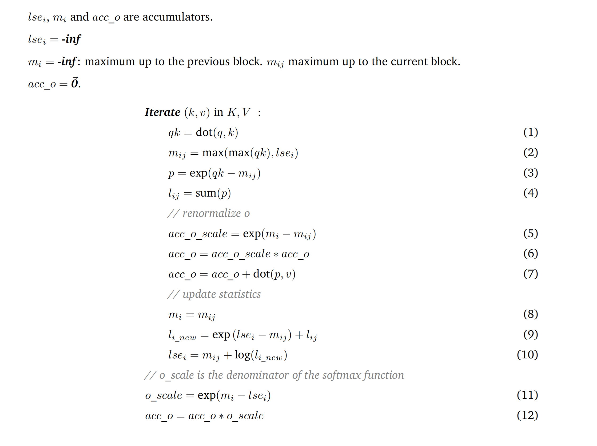

# FlashAttention 笔记

## Standard Self-Attention

$$
S = QK^T,(N \times N) \\
P = softmax(S), (N \times N) \\
O = PV, (N \times d)
$$

### Safe Softmax

$$
safe-softmax = \frac{e^{x_i -m}}{\sum_{j=1}^{N}e^{x_j-m}}
$$

计算 safe-softmax 的时候需要对 [1, N] 重复三次，需要访问 Q 和 K 三次， 并实时重新计算 x，很低效，现在希望将计算进行合并。

现在定义 

$$
d_{i}^{'} = \sum_{j=1}^{i}e^{x_j - m_i}
$$

当 i = N 的时候，有：

$$
d_N = d_{N}^{'} = \sum_{j=1}^{i}e^{x_j - m_N}
$$

$d_{i}^{'}$ 和 $d_{i-1}^{'}$ 有如下递归关系：

$$
d_{i}^{'} = \sum_{j=1}^{i}e^{x_j - m_i} \\
= (\sum_{j=1}^{i-1}e^{x_j - m_i}) + e^{x_i - m_i} \\
= (\sum_{j=1}^{i-1}e^{x_j - m_{i-1}})e^{m_{i-1} - m_i} + e^{x_i - m_i} \\
= d_{i-1}^{'}e^{m_{i-1} - m_i} + e^{x_i - m_i}
$$

递归关系只依赖 $m_{i-1}$ 和 $m_i$，于是可以把 $d_i^{'}$ 和 $m_i$ 放在同一个循环中。

## FlashAttention V1

online softmax 最多只有一个 2-pass 的算法，不存在 1-pass 算法，但是 Attention 可以有 1-pass 算法。基于上述的 online softmax 可以得到一个 1-pass 的 Attention 算法。

重点在第二个循环：

$$
a_i = \frac{e^{x_i - m_N}}{d_N^{'}} \\
o_i = o_{i-1} + a_i V[i,:]
$$

推导 1-pass 版本的 FlashAttention:

$$
o_i^{'} = (\sum_{j=1}^i (\frac{e^{x_j - m_i}}{d_i^{'}})V[j,:]) \\
当 i= N 时有：\\
o_N^{'} = o_N = (\sum_{j=1}^i (\frac{e^{x_j - m_N}}{d_N^{'}})V[j,:]) \\
$$

推导 $o_{i}{'}$ 和 $o_{i-1}{'}$ 之间的关系：

$$
o_i^{'} = (\sum_{j=1}^i (\frac{e^{x_j - m_i}}{d_i^{'}})V[j,:]) \\
= (\sum_{j=1}^{i-1} (\frac{e^{x_j - m_i}}{d_i^{'}})V[j,:]) + (\frac{e^{x_i - m_i}}{d_i^{'}})V[i,:] \\
= (\sum_{j=1}^{i-1} (\frac{e^{x_j - m_{i-1}}}{d_i^{'}})\frac{e^{x_j-m_i}}{e^{x_j-m_{i-1}}}\frac{d_{i-1}^{'}}{d_{i}^{'}}V[j,:]) + (\frac{e^{x_i - m_i}}{d_i^{'}})V[i,:] \\
= o_{i-1}^{'}\frac{d_{i-1}^{'}e^{m_{i-1} - m_i}}{d_i^{'}} + (\frac{e^{x_i - m_i}}{d_i^{'}})V[i,:] \\
$$

可以看到 $o_i^{'}$ 和 $o_{i-1}^{'}$ 递归关系不依赖 $m_n$，因此可以将第二个循环完全合并到第一个循环中去。

## FlashAttention V2

主要做了工程上的优化：
- 减少大量非矩阵乘的冗余计算，增加 Tensor Core 的计算比例
- forward pass/backward pass 均增加 seqlen 维度的并行，forward pass 交替 Q，K，V 循环顺序
- 更好的 Warp Partitioning 策略，避免 Split-K

在 Tri Dao 的 FlashAttention 的 [Triton 实现](https://github.com/Dao-AILab/flash-attention/blob/main/flash_attn/flash_attn_triton.py)中，使用了 LSE(LogSumExp) 来做 smooth maximum。

$$
softmax = \frac{exp(x_i - c)}{\sum_i exp(x_i -c)} \\ 
c = max(x_1,...,x_n)
$$

LSE 可以被用于作为 approximation of max。

$$
LSE(x_1, ..., x_n) = log(exp(x_1)+...+exp(x_n)) \\ 
= c + log \sum_n exp(x_i - c) \\
c = max(x_1,...,x_n)
$$

Triton 中的算法可以被描述为:

等式 $(2)$ 中 `lse_i` 被用于作为最大值的一个近似。

在等式 $(9)$ 中：

$$
exp(lse_i - m_{ij}) = exp(c_{old} + log \sum_n exp(x_i - c_{old}) - c_{new}) + l_{ij} \\ 
= exp((c_{old} - c_{new} + log \sum_n exp(x_i - c_{old}))) \\
= exp(c_{old} - c_{new})\sum_n exp(x_i - c_{old})
$$

在等式 $(11)$ 中的 `o_scale` 作为 softmax 函数的分母：

$$
m_i - lse_i = exp(c - c - log \sum_n exp(x_i - c)) \\
= exp(-log \sum_n exp(x_i - c)) \\ 
= exp(log \frac{1}{\sum_n exp(x_i - c)}) \\ 
= \frac{1}{\sum_n exp(x_i - c)}
$$
