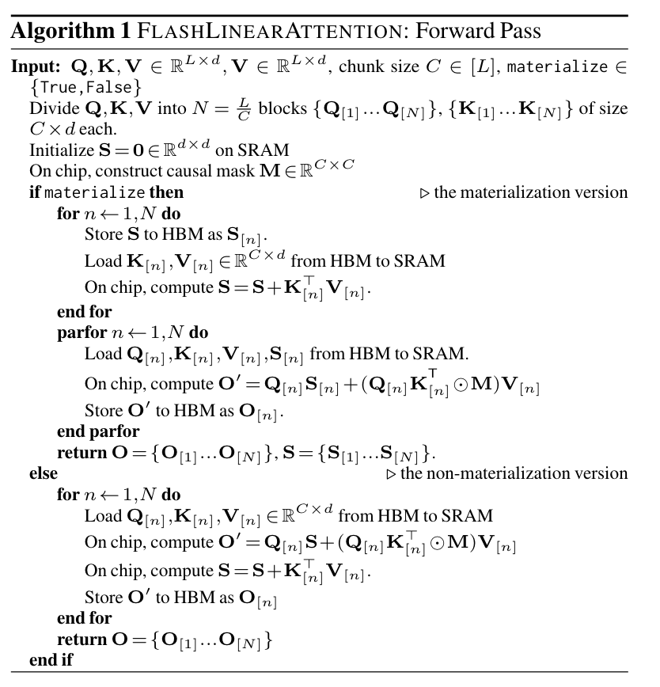
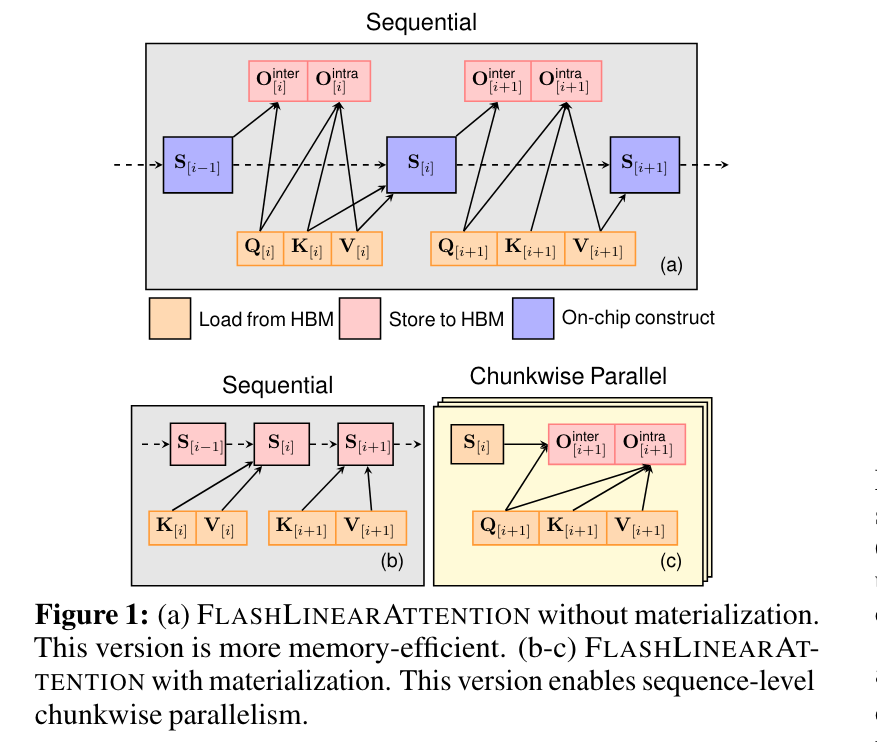
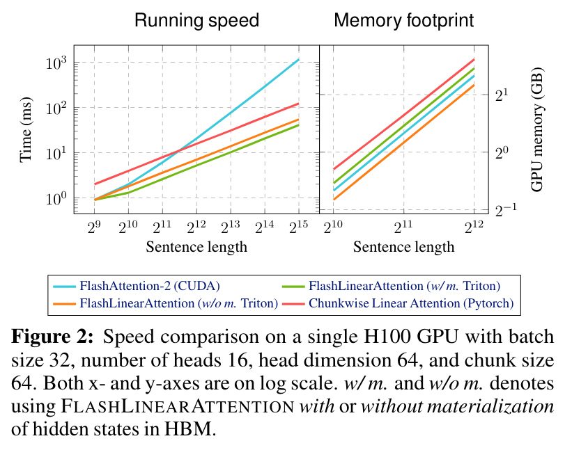
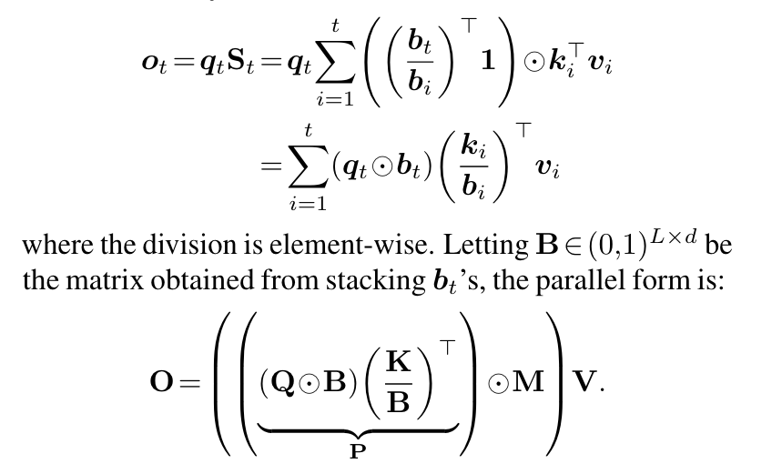
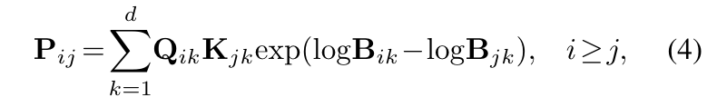
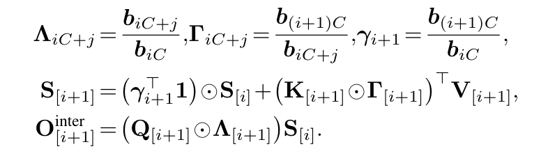
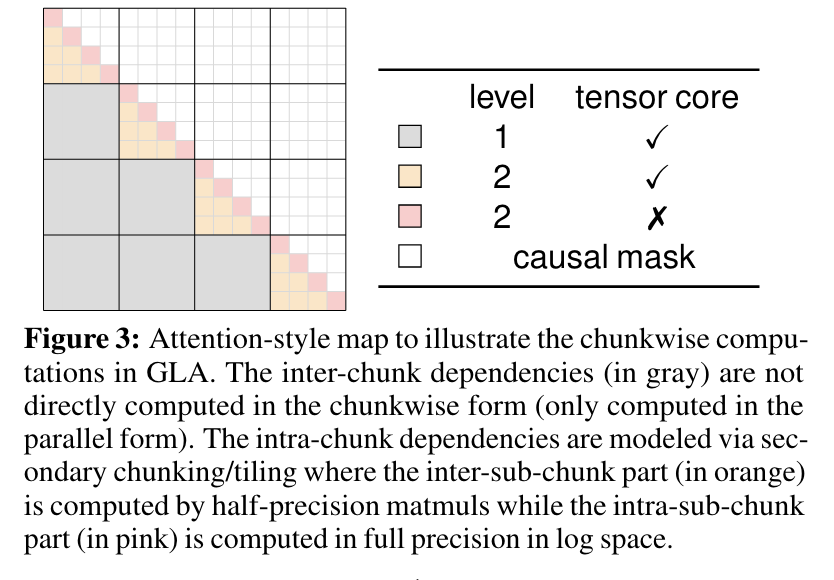
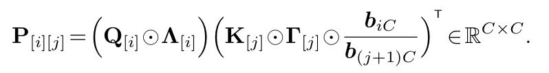
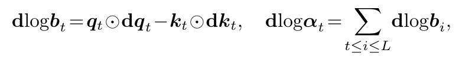
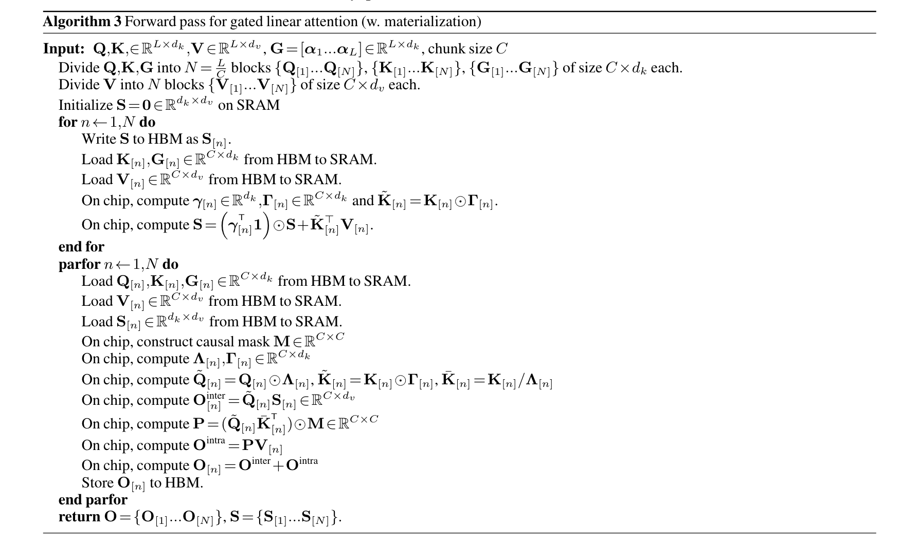

# Linear Attention

$$
O = softmax(QK^T)V
$$

传统的 Attention 因为 softmax 没办法先算右边的矩阵乘，所以整个复杂度变成了 O($n^2$)，由于 d << n，如果可以先算右边的矩阵乘整体复杂度可以变成O(n)。

$$
Attention(Q, K, V)_i = \sum_{j=1}^n \frac{e^{{q_i}^T k_j}}{\sum_{j=1}^n e^{{q_i}^T k_j}} v_j
$$

一般化定义为：

$$
Attention(Q, K, V)_i = \sum_{j=1}^n \frac{k({q_i}^T k_j)}{\sum_{j=1}^n k({q_i}^T k_j)} v_j
$$

其中核函数可以表示为：

$$
k(x, y) = <\phi(x), \phi(y)>
$$

将 softamx 替换成核函数，Attention 可以被简化为：

$$
Attention(Q, K, V)_i = \frac{\sum_{j=1}^n \phi(q^t)\phi(k_i)^Tv_i}{\sum_{j=1}^n \phi(q^t)\phi(k_i)^T} = \frac{\phi(q^t) \sum_{j=1}^n \phi(k_i)^Tv_i}{\phi(q^t)\sum_{j=1}^n\phi(k_i)^T}
$$

## Gated Linear Attention

$$
S_t = S_{t-1} + k_t^{T}v_t, o_t = q_tS_t, (1)
$$

针对 Linear Attention 做硬件优化。

- Occupancy.
- Specialized compute units.
- Memory hierarchy.



Flash Linear Attention 算法有一个 materialize 参数来控制是否要冲计算 S，无论是否要重计算 S 都要分块加载 Q, K, V 到共享内存中，然后可以重用共享内存上的块状 Tensor 来避免多次加载 HBM。

当 materialize 为 True 时，当 $ Q[n] $ 被加载到 SRAM 时，$ Q[n]S $ 和 $ (Q[n]K^T[n] \bigotimes MV)[n] $ 可以在片上计算，避免再次加载 $O[n]$。

当 materialize 为 False 时，算法首先在 HBM 中把块间递归的结果存下来，然后将所有 $S[n]$ 都并行计算在 HBM 中，该算法有更好的并行性，但增加了内存占用。非重计算版本顺序计算 $ S[n] $，并使用 SRAM 暂时存储 $ S[n] $。这种策略在内存上更高效，但缺乏序列级别的并行性。



materialize 为 False 的情况下，Q，K，V 都是从 HBM 加载到 SRAM 上，每次会计算出一个新的隐藏状态 S，S 一直存储在 SRAM 上面，整体计算是串行的。对于 materialize 为 True 的情况，首先计算 KV 酸楚 S 并将 S 保存到 HBM 上，这部分是串行的，计算玩 S 后可以通过 CHunk 并行计算出 $ O_i $。



方程 (1) 中的线性递归没有衰减门或者遗忘门，在 RNN 中缺少衰减项使得模型难以“忘记”信息，这被假设为部分导致线性注意力在长上下文任务中不稳定的原因。最近的研究(RetNet)通过加入一个全局的、与数据无关的衰减因子 $ \gamma \in (0, 1) $ 来解决这个问题。

### GLA 的递归和并行形式

**递归形式**

GLA 有一个二维遗忘门 $ G_t \in (0, 1)^{d \times d}$：

$$
S_t = G_t \odot S_{t-1} + k_t^{T}v_t,  (3)
$$

其中使用外积来获得 $ G_t = \alpha_t \beta_t^T$，其中 $ \alpha_t, \beta_t \in (0, 1)^{1 \times d} $。在实验中发现简单设置 $\beta_t = 1$ 就足够了，因此：

$$
S_t = (\alpha_t 1) \odot S_{t-1} + k_t^{T}v_t, 
$$

其中 $ \alpha_t $ 通过 sigmoid 应用于 $ x_t $ 后由低秩线性层获得。 

**并行形式**

将 (3) 展开可以得到：

$$
S_t = \sum_{i=1}^t ((\prod_{j=i+1}^t \alpha_j^T) \odot k_i^T)v_i 
$$

设 $b_t = \prod_{j=j[1]}^t \alpha_j^T$，则：



但是这种形式在数值上是不稳定的，因为 $ b_i $ 是在 $ \alpha_j \in (0, 1)^{1 \times d} $ 中累积的 gate 值，并且当 t 很大时，$ \frac{K}{B} $ 会变得非常小。为了解决这个问题使用对数计算 P: 




### GLA 的 Chunkwise 形式

上面推导了与线性注意力中的 chunkwise 形式类似的 GLA chunkwise 形式。对于块内 $ O_{intra} $ 仍然是完全并行的方式，对于块间由：



直观地说，$ A_{[i+1]} $ 编码了从一个块的开始出的累积衰减，这将用于传播来自前一个块 $ S_{[i]} $ 的隐藏状态，而 $ \Gamma_{[i+1]} $ 编码了块结束处的衰减，这将用于累计信息以添加到下一个隐藏状态 $ S_{[i+1]} $ 中。 

### Hardware-Efficient GLA

**Secondary-level Chunking**

与普通线性注意力不同，GLA 中的块内计算无法使用 Tensor Core，因为涉及到对数运算（公式(4)）。为了更好地利用 Tensor Core，采用次级级别 Chunk 化方案，即一个块进一步划分为子块，然后以块状方式计算类似注意力的矩阵 $ P \in \mathbb{R}^{L \times L} $。



子块之间的交互是通过半精度矩阵乘法计算的：



以上是对应于图 3 的橙色线条，对于块内子块部分（粉红色块），必须使用公式 (4) 并以全精度执行矩阵乘以确保稳定性。通过两级块化策略，非半精度矩阵乘法 FLOPs 总量大大减少。

**Memory-efficient $d\alpha_t$ computation**

过去的工作生成 GLA 模型必须将大小为 $ L \times L \times d $ 的矩阵值隐藏状态存储在 HBM 中，以计算所有梯度 $ d\alpha_t $，因为 $d\alpha_t = (S_{t-1} \odot S_t)1 $。



在附录中给出了 GLA 的伪代码：

```python
def gated_linear_attention_forward(Q, K, V, a, C, c):
    ''' 
    Q/K/V: query/key/value 
    a: log forget gate 
    C/c: chunk size , subchunk size 
    '''
    # L: sequence length , d: head dimension
    L, d_k = Q.shape
    d_v = V.shape[-1]
    
    S = torch.zeros(d_k, d_v)
    O = torch.empty_like(V)
    
    # cumsum of log decay within a chunk
    B = torch.empty_like(a)  # local compute of cumulative product of decay within a chunk
    
    for i in range(0, L // C):
        b = torch.zeros(d_k)
        for j in range(0, C):
            b += a[i]
        B[i] = b
    
    for i in range(0, L // C):
        r = range(i * C, (i + 1) * C)  # (C, d) chunking
        bq, bk, bv, bb = Q[r], K[r], V[r], B[r]
        b = bb[-1, None]  # inter-chunk w/ matmul
        
        q, k, g = bq * (bb.exp()), bk * ((b - bb).exp()), b.exp()
        o = q @ S  # hidden state update
        S = g.t() * S + k.t() @ bv
        
        # intra-chunk (secondary chunking)
        for j in range(0, C // c):
            t = range(j * c, (j + 1) * c)  # (c, head_dim) subchunking
            q, k, v, b = bq[t], bk[t], bv[t], bb[t]
            p = torch.zeros(c, c)  # intra-subchunk w/o matmul
            
            for m in range(c):
                for n in range(m + 1):
                    p[m, n] = torch.sum(q[m] * k[n] * ((b[m] - b[n]).exp()))
                    
            o[t] += p @ v  # inter-subchunk w/ matmul
            
            z = b[0, None]
            q = q * (b - z).exp()
            
            for u in range(0, j):
                y = range(u * c, (u + 1) * c)
                p = q @ (bk[y] * (z - bb[y]).exp()).t()
                o[t] += p @ bv[y]
    
        O[r] = o
    return O
```



