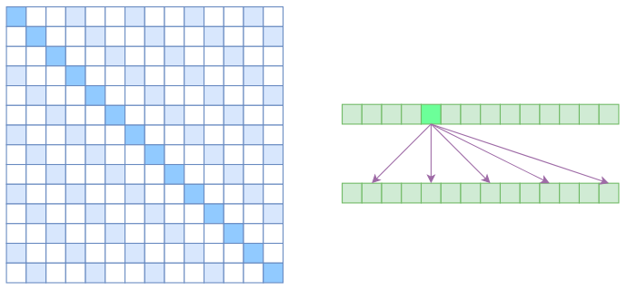
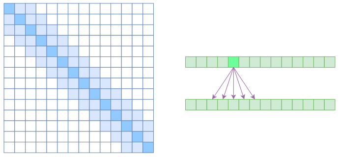
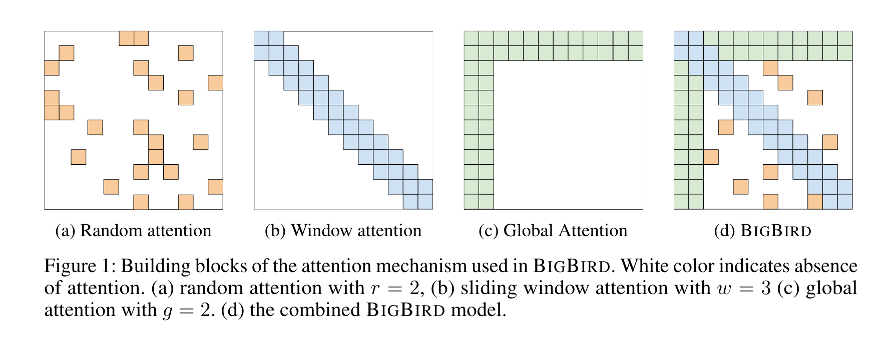

# Sparse Attention

## Sparse Attention

由于 Self-Attention 中的计算复杂度是 $O(n^2)$，因此内存和计算的负载很大。原因在于 Self-Attention 中的每个元素都跟序列中的所有元素关联。要节省显存，加快计算速度，一个基本的思路就是减少关联性的计算，也就是认为每个元素只跟序列内的一部分元素相关，这就是 **Sparse Attention 的基本原理**。

### Atrous Self Attention

中文叫“膨胀自注意力”，“空洞自注意力”，它对相关性进行了约束，强行要求每个元素只跟它相对距离为 k, 2k, 3k, ..., nk 的元素关联，其中 k 是预先设定的超参数。

每个元素只跟大约 $ n/k $ 个元素相关，这样运行效率和显存占用都变成了 $ O(n^2 / k) $，也就是说能直接降低到原来的 $ 1/k $。

### Local Self Attention

中文叫做 “局部自注意力”。约束每个元素只与前后 k 个元素以及自身有关，如下图所示。

Local Self Attention 保留一个 $ 2k+1 $ 大小的滑动窗口，然后只保留窗口内的自注意力。每个元素只和 $ 2k+1 $ 个元素有关，这样显存占用和计算量变为 $ O((2k+1)n) ~ O(kn) $。但是直接牺牲了长程关联性。

### Sparse Attention

这里指的是 OpenAI 的 Sparse Attention: 《Generating Long Sequences with Sparse Transformers》。Atrous Self Attention 是带有一些洞的，而 Local Self Attention 用来填补这些洞。OpenAI 直接将两个 Atrous Self Attention 和 Local Self Attention 合并为一个。

## Big Bird

BigBird 所关注的问题：

- 能否使用更少的内积来完成完全自注意力的经验优势？
- 这些稀疏注意力机制是否保留了原始网络的表达能力和灵活性？

### BigBird Architecture

BigBird 可以由三部分组成：Random Attention + Window Attention + Global Attention。

## References

- 为节约而生：从标准Attention到稀疏Attention, https://spaces.ac.cn/archives/6853#Sparse%20Self%20Attention