# A Survey of LLM Inference Systems

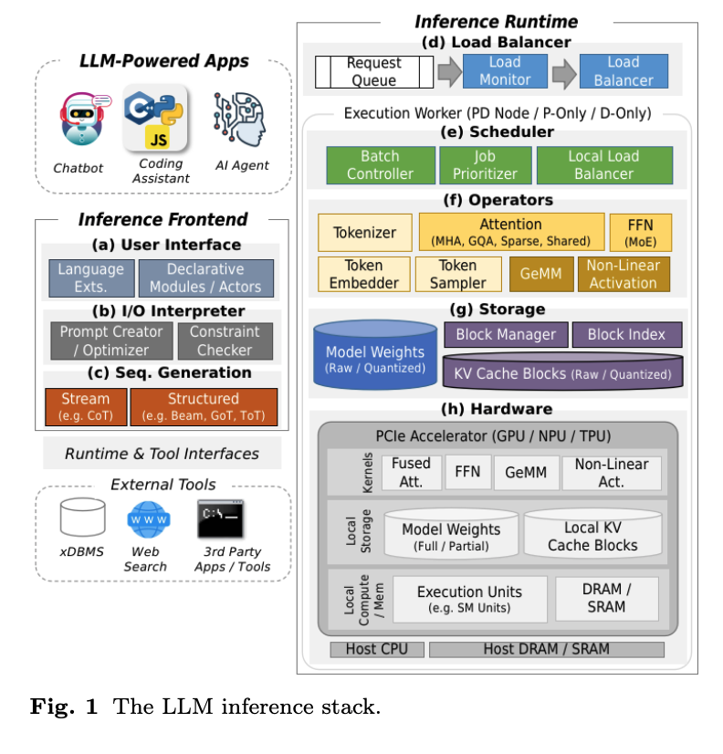

## Request Processing

### Inference Workflow

请求包含一个初始的前缀 $x_1, x_2, ... x_p$，基于此生成一个完整的回复 $x_1, ...,x_p, ..., x_n$。$x_{i+1} = LLM(x_1, ..., x_i)$，输出序列通过反馈前面的 tokens 形成一个 token，这个过程叫做 **autoregressive generation**(自回归生成)。

为了生成 output token，每个输入 token 都会被映射到一个高维度的 embedding 通过 **embedding model**。这些 rmbedding 会流经一系列 Transformer 层，每个 Transformer 层功能相同，但参数设置不同，从而实现 contextualized(上下文化)。输入序列的最后一个 token 的 contextualized embedding 会被输入到 token sampler 中生成 output token。

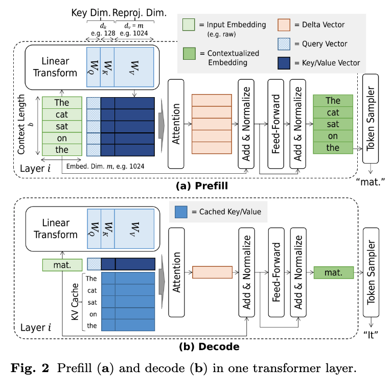

每个 Transformer 中含有一个 Attention 和 FFN，中间还有一个 **Normalization**。Attention 和 FFN 主要通过将 embedding 乘各种权重矩阵来工作，这些权重矩阵的值通过训练确定。具体到注意力算子，针对第 $i$ 个 embedding 需要对 $j$ 个 embedding 进行 **linear projection**(线性投影)，$j < i$。由于序列生成是自回归的这些投影数量（KV Cache）会在请求生命周期内增长。

### Operator

- Attention

针对 token $x_i$ 给定嵌入张量 $x_i$，注意力机制会生成一个增量向量 $u_i$，使得 contextualized embedding vector, $x_i \leftarrow x_i + u_i$ 能够更好地捕捉 token 的语义：

$$
\begin{equation}
u_i = softmax(q_i^TK^T)V
\end{equation}
$$

其中 $q_i^T = x_i^TW_q$，其中 $q_i$ 成为对 token $x_i$ 的查询， $q_i^T$ 称为 **attention pattern**。

K 和 V 矩阵由 $x_i$ 之前的标记(即 $x_1, ..., x_{i-1}$) 构成。具体而言，K 的第 j 行($k_j$) 以及 V 的第 j 行($V_j$)对应于第 j 个 embedding vector 的线性投影。换句话说，对于 0 到 i 之间的所有 j 都有

$$
K^T_j = x^T_j W_k,
V^T_j = x^T_j W_v
$$

由于 K，V 矩阵在整个请求的生命周期都会使用，因此它们会保存在内存中，通常被称为 **KV Cache**。

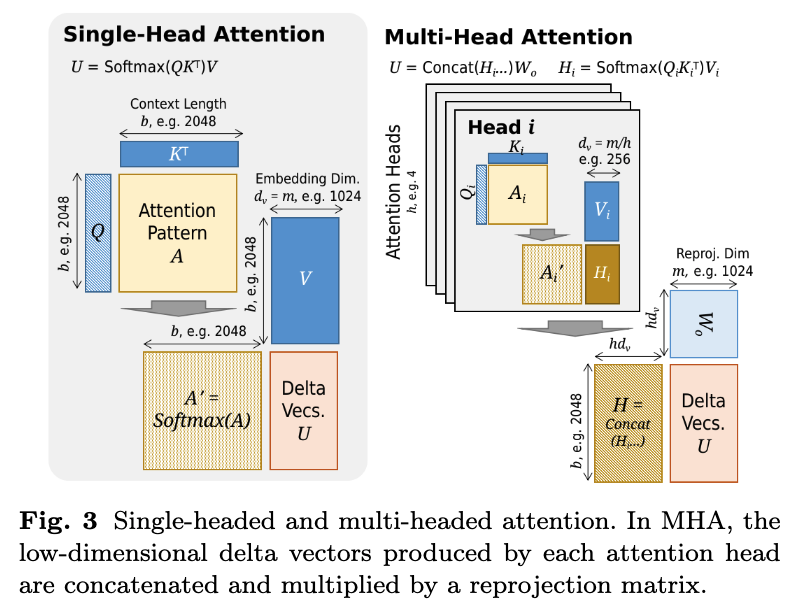

**Prefill and Batch.** 对 prefill 阶段，所有 prompt 被垂直连接成为单个输入矩阵 $X$，然后将其与每个权重矩阵相乘，随后经过 Attention 计算获得更新向量。

$$
\begin{equation}
U = softmax(QK^T)V
\end{equation}
$$

在数据并行硬件中，即使基本成本相同，使用（2）一次计算也比使用（1）多次计算更高。除了预填充外，此属性还促成了请求批处理，从而有效第允许再一次调用中对多个请求执行多次解码。

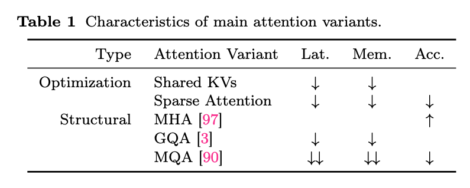

**Attention Variants.** 对于 long prompts 的请求，需要大量解码轮次，K，V 的行数可能会非常长。
- MHA：垂直分割 $W_q$, $W_k$, $W_v$ 并行化公式（1）和（2）。
- 分组注意力：通过删除一些小矩阵直接降低成本，参考图（4）和表（1）。
- 稀疏注意力：通过仅计算某些键的注意力模式来降低计算成本。
- 共享注意力：通过在多个输入之间共享注意力模式来降低内存和计算成本，这些输入可能属于单个请求(beam search)也可能属于多个请求（system prompt），该技术通过仅计算一次共享 token 的注意力来降低计算成本。

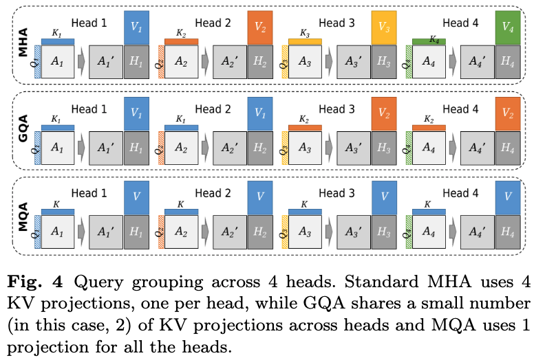

- Feed-Forward Network

给定嵌入向量 $x_i$，FFN计算 $x_i \leftarrow f_2(g(f_1(x_i)))$，其中 $f_1(x_i) = x^T_iW_1 + b_1$，$f_2(h) = h^TW_2 + b_2$，$g(h)$ 是一个非线性激活函数，例如 $g(h) = max(0, h)$，代入可得：

$$
\begin{equation}
FFN(x_i) = max(0, X^T_iW_1 + b_1)^TW_2 + b_2
\end{equation}
$$

计算和内存成本与参数大小成正比，但与注意力机制不同，注意力机制的成本会根据 KV Cache 的大小变化，而 FFN 的成本对于所有输入都是相通的。

**Mixture-of-Experts.** 在 MoE 系统中，FFN 被一组较小的网络取代，每个网络称为一个专家。门电路决定使用哪个专家来处理给定的输入。由于每个专家都比原始 FFN 小得多，因此计算成本显著降低。MoE 系统的大部分工作集中在专家架构、门电路设计、专家的动态加载以及专家计算的硬件优化上。在分布式环境中，还需要考虑专家的布局和负载均衡。

- Token Sampling

Token Sampling 是指在生成文本时，从模型给出的概率分布中选择下一个 token 的策略。模型会为词汇表中的每个 token 计算一个概率，采样策略决定了如何从这些概率中挑选出下一个词。这不仅影响生成文本的流畅性和相关性，也决定了文本的多样性和创造性。

给定上下文 $x_i$，token sampler 计算 $p = softmax(x^T_iW_b)$，从而得到 token 范围的 **probability masses**（概率质量）。p 的长度等于可能的 token 数量，p 的索引与 token 范围之间的映射用于根据选定的索引确定令牌。这启发了其他采样策略，例如 $\textit{top-k}$ 采样或 $\textit{nucleus}$ 采样。同时，公式（2）的并行解码能力激发了 speculative decoding，以提高 token 吞吐量。

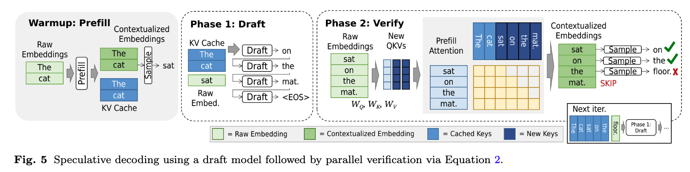

### Sequence Generation

为了生成完整的输出序列，可以将部分生成的序列递归地反馈到模型中，以流式方式生成下一个标记，一旦达到终止条件（例如，生成终止标记）就停止。但是，提示中的细微差异，例如 $\textit{chain-of-thout}$ (CoT)、$\textit{few-shot-examples}$(小样本示例)和其他提示工程技术，都可能导致输出的巨大差异，从而影响成本和准确性。另一方面，结构化生成方法会跟踪一组潜在的输出序列，在选择其中一个候选序列作为最终输出序列之前，会自回归地将每个候选序列推进到所需的距离。这些方法，例如 $\textit{beam search}$、$\textit{tree-of-thoughts}$、$\textit{graph-of-thoughts}$ 和 $\textit{self-consistency}$，会使请求处理成本成倍增加，但可以为许多任务带来更高质量的输出。

  

    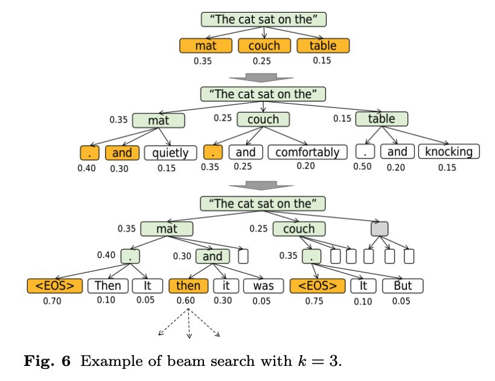
  

  

    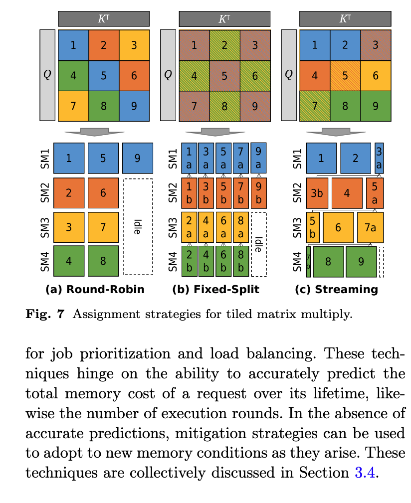
  

## Model Optimization and Execution

### Kernels

- Attention Kernels

**Blockwise Attention.** 为了提高核心利用率，$\textit{Stream-K}$ 将矩阵乘积划分为缓存本地块，并按顺序将每个块中的标量分配给处理器核心，如图 7(c) 所示。Stream 策略可以消除其他策略导致的处理器空闲。FlashAttention 使用 $\textit{round-robin}$ 策略，FlashDecoding 使用 $\textit{fixed-split}$ 策略，Lean Attention 和 FlashInfer 使用 $\textit{streaming}$ 策略。

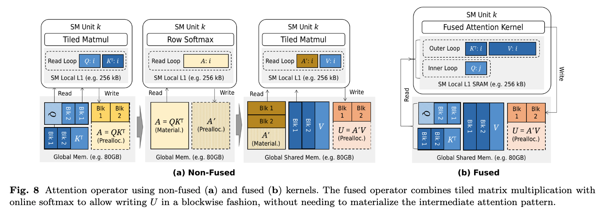

**Distributed Attention.** Ring Attention

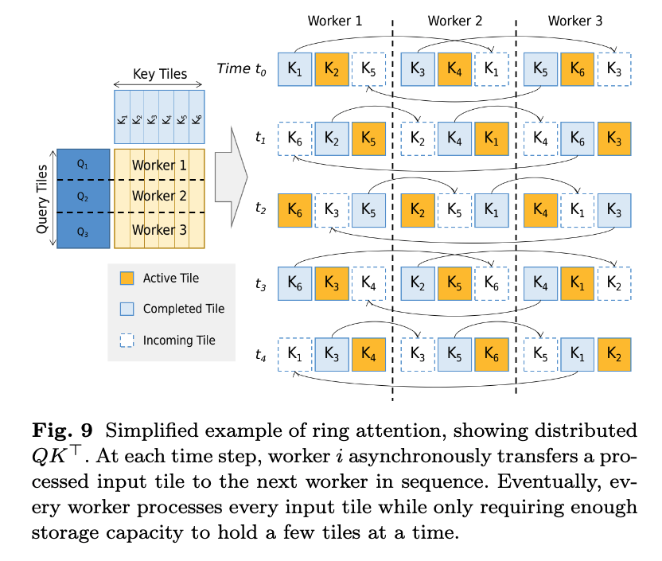

- Other Kernels

对于 FFN，$f_1$、$f_2$ 和 $g$ 函数均可 $\textit{element-wise}$ 实现，从而可以将它们流水线化到单个融合内核中。此特性还允许将其直接融合到块级注意力内核中，从而适度降低延迟。

对于其他算子，LightSeq 将连续的非 GeMM 操作组合到单个融合内核中，从而生成多个用于 $\textit{layer normalization}$、$\textit{tensor reshape}$、$\textit{softmax}$ 和 $\textit{ReLU}$ 激活等操作的手工内核。与基于供应商内核的实现相比，每个 Transformer 块的内核调用次数减少了 4 倍。

除了融合内核之外，DeepSpeed-Inference还利用 CUDA Graphs 通过一次调用启动多个内核。

### Batching

在计算注意力模式之前，将输入向量乘以 $W_Q$、$W_K$ 和 $W_V$，以生成低维查询、键和值向量。这些向量可以通过计算单个矩阵乘积来生成，对于多个批量请求，则可以通过水平连接权重矩阵和垂直连接标记向量来生成。同样，生成的向量可以与 $\textit{KV Cache}$ 中的向量连接起来，形成用于批量注意力的三维矩阵输入。图 10(a) 展示了这种技术。

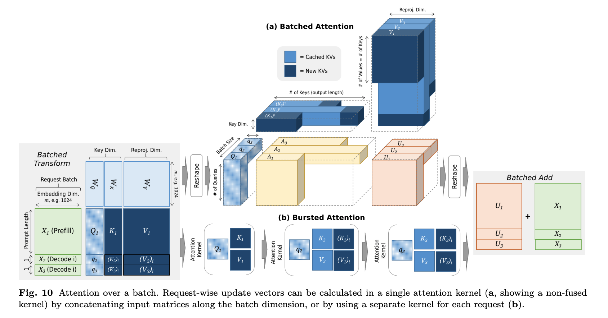

如果批量注意力算子的输入不均匀，也就是说，每个请求的查询矩阵和键矩阵的长度或宽度不相等，那么计算矩阵乘积可能会导致处理器核心因矩阵稀疏性而利用不足。如果批量注意力算子的输入不均匀，也就是说，每个请求的查询矩阵和键矩阵的长度或宽度不相等，那么计算矩阵乘积可能会导致处理器核心因矩阵稀疏性而利用不足。另一方面，brusting 可以避免稀疏矩阵，但需要单独启动内核，每个请求对应一个内核(图10(b))。

**Dynamic Batching.** 在静态批处理中，批处理的请求会被一起执行与返回，因此即使某些请求可能比其他请求更早达到终止状态，它们的延迟看起来也相等。Continuous Batching 通过在迭代之间动态插入和删除批处理中的请求来解决此问题，从而提高了 GPU 利用率。

(1) $\textit{continuous batching}$ 会在每轮执行后而不是完成时重新构建批处理（Orca: A distributed serving system for transformer-based generative models）。
(2) $\textit{Chunked prefill}$ 将 continous batching 的理念扩展到 prefill 阶段，方法是请求拆分成小块，并在多个执行轮次处理。

  

    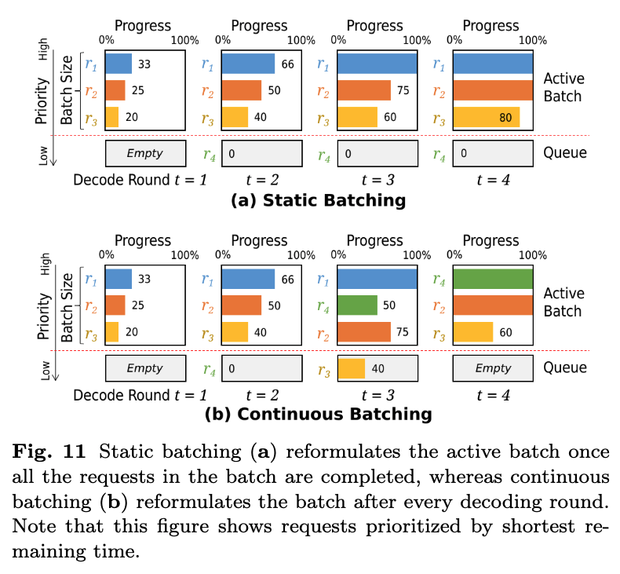
  

  

    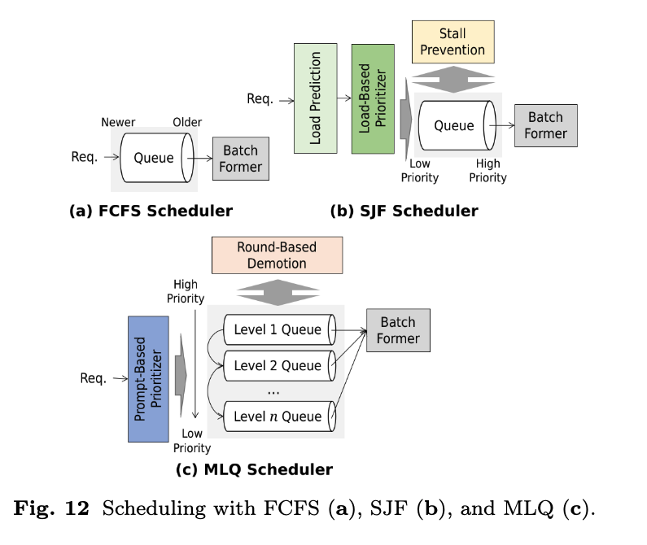
  

### Scheduling

TODO

## Memory Management

如果不考虑 $\textit{KV Cache}$ 的内存占用，可能会导致内存容器的过量分配（$\textit{over-subscription}$），从而导致代价高昂的内存交换。作为预防措施，可以在请求时为每个请求预分配最大内存，从而避免容器过量分配。然而，除了长度受限的生成之外，$\textit{KV Cache}$ 的确切最终大小是未知的，这可能会因过度分配而导致内存浪费。即使已知最终大小，预先分配内存也会阻止其他请求在此期间使用该内存。

与静态预分配不同，动态的基于分页的内存管理（$\textit{dynamic paged-based memory management}$）会根据需要以小块的形式分配内存，避免因大量保留内存而导致的实际利用率低下。同时，为了减轻内存负担，可以使用驱逐和卸载技术（$\textit{eviction and offloading techniques}$）从内存容器中删除不需要的 $\textit{KV}$ 条目，而量化技术（$\textit{quantization techniques}$）可用于减少物理字节大小。在某些情况下，例如当存在共享系统提示（$\textit{shared system prompt}$）或在某些 $\textit{RAG}$ 工作流中时，可以使用缓存持久化技术（$\textit{cache persistence techniques}$）来允许跨多个请求重用 $\textit{KV}$ 条目，从而避免代价高昂的重新计算和存储冗余。卸载、恢复、量化和持久化技术的各种组合为新型内存方案开辟了潜力。

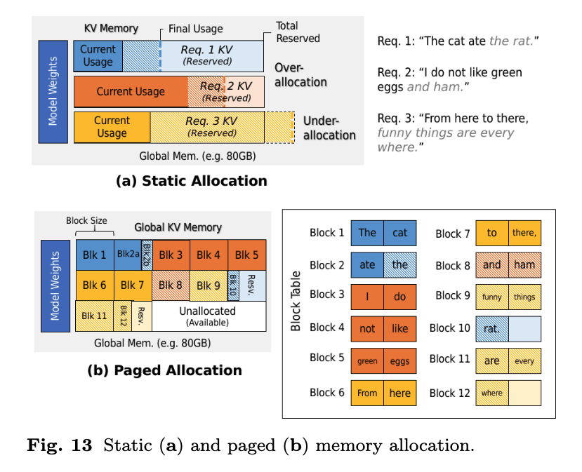

### Paged-Based Memory Allocation

由于 $\textit{KV Cache}$ 在每轮解码中逐渐增长，因此根据需要以小块的形式分配内存可以避免与静态预分配相比的大量前期内存成本。然而，动态的块级分配可能会导致非连续的 $\textit{KV Cache}$，这需要一个内存管理器来将逻辑缓存条目（即缓存页）映射到物理块，以及专门为非连续内存范围设计的基于分页的内核。但除了支持动态分配之外，基于分页的内存还为块共享（$\textit{block sharing}$）提供了机会，以避免重新计算和存储冗余。块共享构成了缓存持久化技术的基础。

**Memory Manager.** 内存管理器负责页面的创建、删除和查找。为了跟踪页面块地址和内容（即映射到页面中存储的 KV 条目的 token 及其在序列中的位置），可以使用页表来列出每个页面的地址和内容（图 13）。在 vLLM 中，GPU 内存作为内存容器，内存管理器和页表在主机上实现。

对于使用基于 CPU 的内存管理器的基于 GPU 的系统，由于物理块驻留在 GPU 上,页面创建和删除会导致从 CPU 向 GPU 提交内存分配和释放命令。同样，由在 GPU 内运行的特殊页感知注意力内核执行的页面查找会导致从内核向内存管理器提交查找命令。在 vAttention 中，通过利用 GPU 的原生内存管理能力来减少这些通信产生的开销。这样做还有一个次要优势，即使缓存在内核看来就像存储在连续内存中一样，从而可以使用非分页内核。

**Block Sharing.** 为了实现 $\textit{block sharing}$，可以将对应于不同请求的多个页面条目简单地分配给同一个块地址。何时以这种方式链接页面的条件取决于共享注意力机制（第 4.4 节）。在 (1) $\textit{exact match sharing}$（精确匹配共享）中，只有一个或多个请求之间最长公共前缀的缓存条目可以被共享。块大小会影响这些共享机会的数量，因为页表只允许共享整个块。较小的块大小使得更容易找到块中所有条目都满足此条件的块，但同时会增加推理期间块检索的数量。在 (2) $\textit{partial match sharing}$（部分匹配共享）中，此条件被放宽以允许部分前缀匹配，即共享一些或全部相同 $\textit{token}$ 的前缀，这些 $\textit{token}$ 也可能是乱序的。

### Eviction and Offloading

缓存驱逐（$\textit{cache eviction}$）和卸载（$\textit{offloading}$）对于支持抢占（$\textit{preemption}$）是必要的，但对于支持超出内存容器的长上下文也很有用。在抢占的情况下，可以驱逐或卸载低优先级请求的缓存条目，以便为高优先级请求腾出空间。由于被抢占的请求最终必须恢复，因此是驱逐还是卸载主要取决于恢复成本。在长上下文的情况下，可以驱逐对最终输出序列影响很小的不重要条目，以允许解码继续进行，即稀疏注意力（$\textit{sparse attention}$）。要驱逐哪些条目可能取决于多种因素，包括 $\textit{token}$ 位置和注意力分数。或者，也可以部分卸载大型缓存，利用分层存储来补充内存容器。但与被抢占的请求一样，卸载的条目最终必须重新加载到内存容器中，这导致了旨在平衡内存使用和恢复成本的技术。对于持久化缓存，可以使用缓存驱逐来控制缓存的大小，并且可以为此目的采用传统的缓存控制技术，例如 $\textit{LRU}$。

被驱逐的条目可以通过基于部分 $\textit{LLM}$ 输出重新计算键和值向量来恢复，而卸载的条目可以通过将它们传输回内存容器来恢复。对于经历了少量解码轮次的具有短提示的被抢占请求，重新计算实际上可能比从卸载存储加载更快，这种权衡在相关研究中进行了探讨。对于卸载的缓存，可以通过提前异步执行传输来降低有效传输成本，将传输与其他模型执行阶段重叠以隐藏传输延迟。对于分解式运行时（$\textit{disaggregated runtimes}$），解码工作器必须在解码开始之前从预填充工作器恢复缓存条目。如果解码工作器与预填充工作器同时选择，则可以异步恢复缓存，即在预填充时将条目流式传输到解码工作器。

**Long Context Eviction.** 驱逐特定的缓存条目可以为更重要的条目腾出空间，同时最小化对输出质量的影响。

(1) $\textit{Position-based policies}$（基于位置的策略）根据相应 $\textit{token}$ 相对于输出序列的位置对缓存条目进行排序。研究发现，靠近输出序列开头或尾部的 $\textit{token}$ 与其他 $\textit{token}$ 相比具有更大的注意力值，这导致了一种通过手工制作的注意力掩码来针对这些特殊位置的驱逐策略（图 14(b)）。

(2) $\textit{Attention-based policies}$（基于注意力的策略）根据缓存条目的注意力值对其进行排序（图 14(c)）。为了提高准确性，相关技术包括添加非对称噪声、在解码轮次中平均分数，或使用累积分数。

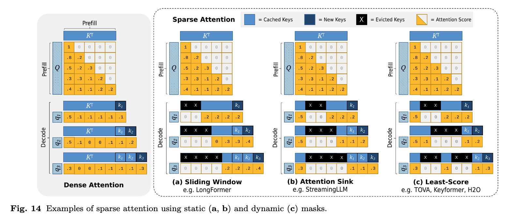

**Long Context Offloading.** 或者，长上下文卸载可用于将大型 $\textit{KV Cache}$ 分布在分层存储中，同时保持缓存完全完整。

(1) $\textit{Layer-wise offloading}$（逐层卸载）将某些或所有 $\textit{transformer}$ 层的缓存移动到辅助缓存存储中。由于模型执行是逐层进行的，因此可以在执行第 $i$ 层期间异步传输第 $i + 1$ 层的缓存，从而有效地隐藏传输延迟。然而，对于大型缓存，传输成本可能很高，因此 

(2) $\textit{Model-wise offloading}$（模型级卸载）仅部分卸载所有层的缓存，允许通过设置卸载比例来控制传输成本（图 15）。

  

    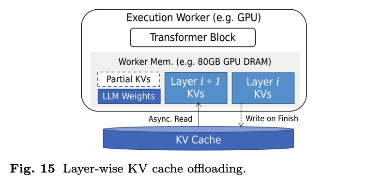
  

  

    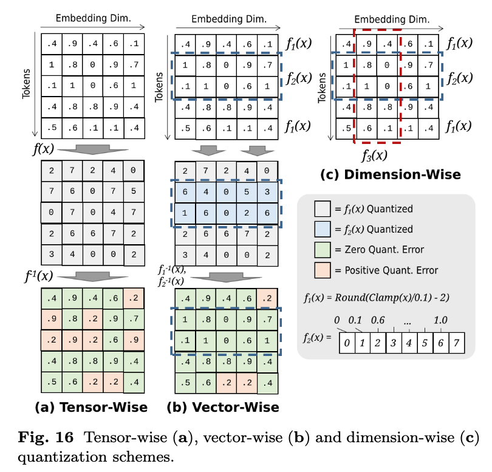
  

### Quantization

量化（$\textit{Quantization}$）通过降低数值精度来减少物理字节大小。为了避免降低推理质量，量化器被设计为在缩减的范围内最大限度地保留原始范围中信息丰富的区域。均匀量化器（$\textit{Uniform quantizers}$）通过数值舍入将浮点数映射到压缩范围（例如整数），由偏移量和范围高低端的钳位参数化，而非均匀量化器（$\textit{non-uniform quantizers}$）旨在通过非线性方法进一步减少信息损失。由于模型组件的信息内容各不相同，还可以通过为各个组件应用单独的量化器来提高质量，从而产生基于张量级（$\textit{tensor-wise}$）、向量级（$\textit{vector-wise}$）和维度级（$\textit{dimension-wise}$）量化的量化方案（图 16）。此外，异常值保护技术（$\textit{outlier protection techniques}$），例如混合精度保留（$\textit{mixed-precision preservation}$）（图 17）和异常值平滑（$\textit{outlier smoothing}$）（图 18），可用于防止因量化显著异常值而导致的质量下降。

**Quantizer Design.** 对于均匀和非均匀量化器，设计通常旨在最小化量化前后的损失函数，例如均方误差。对于采用 $\lfloor x/s \rceil + z$ 形式的均匀量化器，少量参数使得网格搜索成为发现最优值的可行技术。对于非均匀量化器，可以使用分桶（$\textit{bucketing}$）等技术或更复杂的搜索算法来直接发现映射。

**Quantization Schemes.** 由于模型权重往往需要大量存储空间，(1) 对权重矩阵进行张量级量化（$\textit{tensor-wise quantization}$）可以直接带来大量存储节省。对于激活矩阵，(2) 向量级量化（$\textit{vector-wise quantization}$）通过将矩阵分层为 $g$ 个组（每个组包含 $n/g$ 个嵌入向量），然后对每个组应用不同的量化器，从而对量化矩阵的质量提供更精细的控制。可以根据必要的粒度调整 $g$ 值。较高的 $g$ 值可以对量化范围提供更精细的控制，但需要训练更多的量化器并使下游矩阵乘法操作复杂化。为了实现更精细的控制，(3) 维度级量化（$\textit{dimension-wise quantization}$）将每个向量划分为 $k$ 个段，有效地将 $d$ 维向量空间划分为 $d/k$ 维子空间，然后在每个段上应用单独的量化器。

**Outlier Protection.** 异常值已被证明会不成比例地影响模型质量。(1) 混合精度保留（$\textit{Mixed-precision preservation}$）以原始形式保留异常值，但会导致张量处于混合精度状态。可以使用专门的数据结构来存储这些张量，例如通过为低精度和高精度值使用单独的字节区域（图 17），但对这些结构进行操作需要能够识别区域的专门解码器或内核算子。另一方面，(2) 异常值平滑（$\textit{outlier smoothing}$）可用于在矩阵乘法期间避免混合精度张量，同时仍然保留来自异常值的信息。给定两个矩阵操作数，该技术应用标量除法来降低高方差矩阵中异常值的有效强度，同时在低方差矩阵中执行反向缩放，从而有效地在矩阵乘积内保留高方差信息（图 18）。在某些研究中，此技术应用于激活和权重矩阵，而在其他研究中，此技术应用于构成 $\textit{KV Cache}$ 的键和值矩阵。

  

    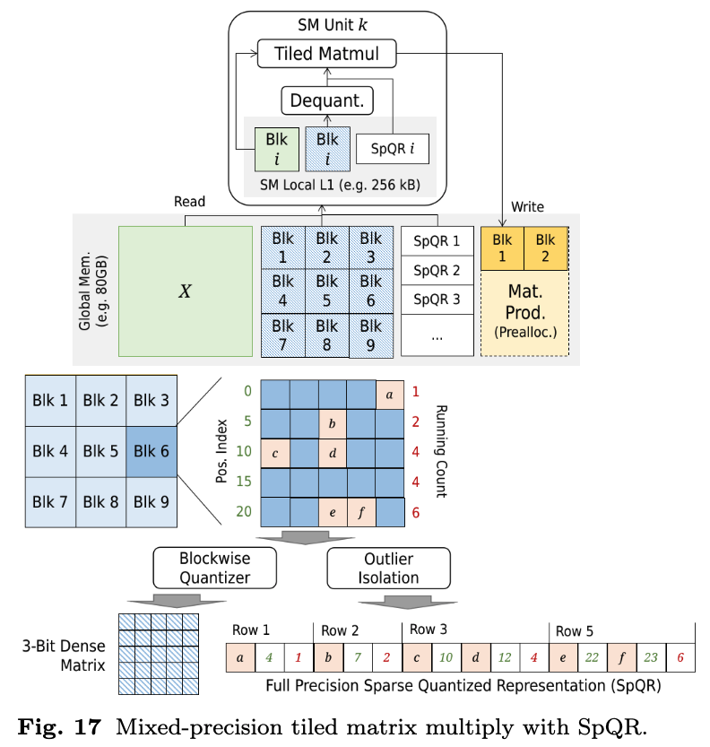
  

  

    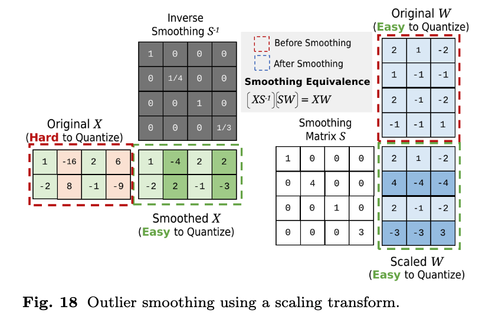
  

### Cache Persistence

缓存持久化（$\textit{Cache Persistence}$）允许在请求之间共享 $\textit{KV Cache}$ 条目，从而减少冗余计算。内部注意力层中的 $\textit{KV}$ 向量根据其各自 $\textit{token}$ 在生成序列中的位置而具有不同的值。因此，两个请求的 $\textit{KV}$ 条目仅在其序列中 $\textit{token}$ 不同的第一个位置之前是相同的，这导致了直接缓存共享的精确匹配条件。但在某些情况下，$\textit{KV}$ 条目仍然可以在一定程度上共享。例如，在 $\textit{RAG}$ 工作流中，即使提示不同，两个请求也可能使用相同的文档块。

(1) $\textit{Prefix sharing}$（前缀共享）技术在精确匹配前缀下重用持久化的缓存条目。为了找到最长匹配前缀，可以从头到尾扫描请求前缀，在每个 $\textit{token}$ 处执行缓存查找，以查看该 $\textit{token}$ 在序列中的位置是否已存在缓存条目。如果存在许多持久化的缓存块，可以使用索引结构（例如基数树）来加速此检索。对于部分匹配共享，(2) $\textit{Selective reconstruction}$（选择性重建）技术通过重新计算最具影响力的 $\textit{token}$ 子集的 $\textit{KV}$ 条目来缓解使用非对齐条目导致的质量下降，如图 19 所示。这些 $\textit{token}$ 可以通过使用第一个 $\textit{transformer}$ 层中的注意力分数偏差作为排序标准来识别，或者通过使用 $\textit{token}$ 位置作为启发式方法来识别。

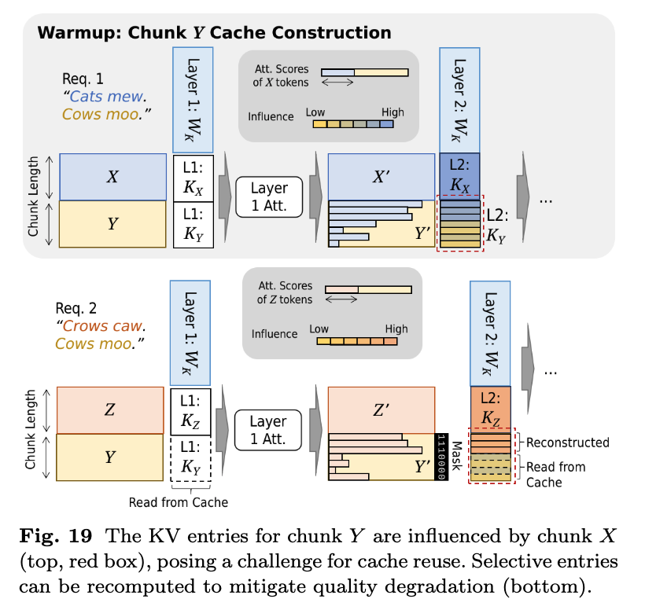

## Inference Systems

在 **LLM** 推理系统中，各种请求处理、执行和内存管理技术被结合起来，以支持高效和高质量地处理通用 **LLM** 工作负载，或针对更具体的应用。一个完整的推理系统由前端（$\textit{frontend}$）和运行时（$\textit{runtime}$）组成。前端允许用户交互，例如通过声明式或命令式接口，并可能提供诸如结构化输出和自动提示优化等功能。运行时管理模型执行的所有其他方面，单副本运行时（$\textit{single-replica runtimes}$）针对单个 LLM 上的请求处理，而多副本运行时（$\textit{multireplica runtimes}$）针对具有多个相同 LLM 的环境。单副本和多副本系统都可以支持分布式执行（$\textit{distributed execution}$），而后者还可以被设计为支持分解式执行（$\textit{disaggregated execution}$）。

