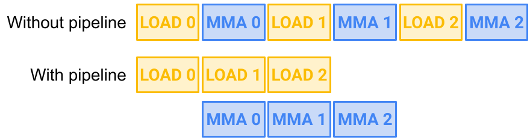
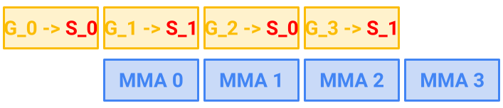

# GEMM Pipeline 技术

由于 Tensor Core 的计算能力很高，已经成为了消耗数据的野兽。

> For instance, the H200 SXM GPU’s tensor cores can deliver up to 3,958 TFLOPS (TeraFLOPs per second). 

另一方面，H200 SXM GPU 的内存带宽仅为 4.8 TB/s。

> On the other hand, the memory bandwidth of the same H200 SXM GPU is only 4.8 TB/s (TeraBytes per second). 

这种数据传输速度比张量核心的速度慢的多，而且通常很难利用，因此 CUDA 编程的一个主题是弄清楚如何快速复制数据以保持 Tensor Core 忙碌，被称为 "feeding the beast"。

一般来说，有两种方法来 "feed the beast"，针对的是不同的 scopes(grid vs block)。第一个是 **threadblock scheduling**，这需要在 CTAs 分配计算获得良好的负载均衡和更高的 L2 Cache 命中率。第二个技术室 **overlap copyinh with math operations**。当 Tensor Core 在保持忙碌的时候，我们应该拷贝下一批数据。这种方式可以有效隐藏部分拷贝延迟，这是 pipeline 的目标。

## Latency, warps, and warp-sepcialization

使用 **overlap copyinh with math operations** 技术有点类似于 cache prefetching 技术，在需要数据之前发出异步请求。GPU pipeline 技术和 CPU 中的 cache prefetching 技术几乎相同，然而由于 GPU 上的芯片面积方面成本高昂，因此该技术的实现方式不同。

GPU 创建重叠的方式是通过多余的 warps(excess warps)。NVIDIA GPU 每个 SM 允许大量的 warps 并且能够以最小开销进行切换。warp schedules 能够切换到另一个 warp 当一个 warp 正在执行 slow memory fetch。为了给 warp schedulers 更多的机会隐藏延迟，一个被叫做 **warp-specilazation** 的技术被提出。使用 warp-specilzation 技术时，一些 waprs 进行 memory fetched，另一些去计算，并且使用 barriers 来进行同步。

在安培架构出现后，NVIDIA 提出了 `cp.async`，允许内存拷贝在执行计算的同时进行。具体来说，异步意味着 warp 可以发出 `cp.async` 将数据加载到下一个缓冲区，然后再当前缓冲区执行数学运算，而不会在异步加载完成时停滞。因此这消除了使用 warp-specialization 来屏蔽计算数据传输的需要。

## Pipelining Illustrated

Figure 1 的问题是 `LOAD_1` 和 `LOAD_2` 将拷贝数据到哪里？显然我们不想要后续的加载在 MMA 计算前覆盖先前的数据，我们也不希望 SMEM 被自由写入而造成不必要的停顿。

解决此问题的一个简单方式是在 SMEM 中预留两倍于 MMA 所需内存，并以交替方式使用它们，这被称为双缓冲（Double Buffer）。当然我们也可以推广到拥有两个以上的交替缓冲区，这样做可以创造更多的重叠机会，从而更有效地利用可用硬件，但代价是使用更多 SMEM。

Figure 2 有两个交替的 SMEM: S_0 和 S_1。全局图块不断增加，而不是像 SMEM 阶段那样交替，因此每一步都在新的图块上进行操作。

## CUTLASS Pipeline abstraction

CUTLASS 的异步 Pipeline classes 可作为有效的抽象，用于管理跨多个数据缓冲区和参与线程的肤质和计算，它们包括 `PipelineAsync`、`PipelineTmaAsync`、`PipelineTransactionAsync` class。

我们首先解释 CUTLASS Pipeline 如何在高层协调流水线数据。假设共享内存有 N 个 stages。我们希望生产者将数据写到 buffers 中（例如 TMA），消费者操作数据（例如 WGMMA）。

**Barriers.** 为了在生产者和消费者之间同步 buffer stages，Pipeline 使用标准 acquire 和 release 模型使用锁来管理对 buffers 的访问。为此，让 `full_barrier` 和 `empty_barrier` 乘两个 barrier objects 的组，大小为 N。这些 barrier 对象具有一个相位位值，该值初始化为 0 并在 0 和 1 之间翻转。

具体来说，这些 barrier objects 将是主流在 SMEM 上的 mbarrier 对象。