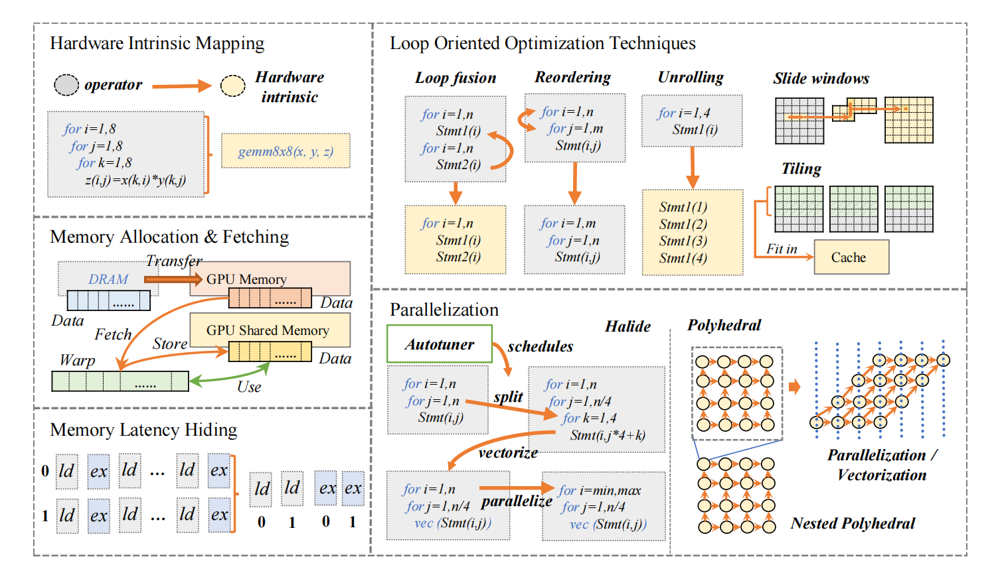

# The Deep Learning Compiler: A Comprehensive Survey

## Deep Learning Framework

- Tensorflow

- Keras

- Pytorch

- Caffee/Caffee2

- MXNet

- CNTK

- PaddlePaddle

- ONNX

## Deep Learning Hardware

- GPU

- FPGA/ASIC

- Neuromorphic Hardware

## Hardware-specific DL Code Generator

可以通过模型编译生成对应的 HLS bitstream，不做详细讨论。

## Common Design Architecture Of DL Compilers

### Compiler Frontend

**High-Level IR**也叫做 graph IR，与硬件无关，用来表示抽象和控制流。**FrontEnd**接受现有DL框架中的DL模型作为输入，然后将模型转换为计算图表示（例如图形IR）。前端需要实现各种格式转换以支持不同框架中的多样化格式。计算图优化包括来自通用编译器和DL特定优化的优化技术，可以减少图形IR上的冗余并提高效率。这些优化可以分为节点级别（例如nop消除和零维张量消除）、块级别（例如代数简化、操作融合和操作下沉）和数据流级别（例如公共子表达式消除、死代码消除、静态内存规划和布局转换）。

### Compiler Backend

**Low-Level IR** 是针对各种硬件目标的硬件特定优化和代码生成而设计的。因此，低级IR应该足够细粒度，以反映硬件特性并表示硬件特定的优化。**BackEnd**将 High-Level IR 转换为 Low-Level IR，并进行硬件特定的优化。一方面，它可以直接将高级IR转换为第三方工具链（如LLVM IR），以利用现有的通用优化和代码生成基础设施。另一方面，它可以利用DL模型和硬件特性的先前知识，通过定制化编译通路进行更高效的代码生成。常用的硬件特定优化包括硬件内部函数映射、内存分配和获取、内存延迟隐藏、并行化以及基于循环的优化。为了确定大规模优化空间中的最佳参数设置，在现有的DL编译器中广泛采用了两种方法，例如自动调度（如多面体模型）和自动调优（例如AutoTVM）。优化后的低级IR使用即时编译（JIT）或提前编译（AOT）生成不同硬件目标的代码。

Low Level IR 分为：

- **Halide-based IR**：Halide 基本思想为将计算和调度分离。相较于直接给定一个特定的模式，Halide 会尝试各种可能的调度方式并选择最好的一个。
- **Polyhedral-based IR**：Polyhedral 模型使用 linear programming, affine transformations 以及其他的数学方法来优化具有静态控制流边界和分支的以循环为基础的代码。
- **其他 IR**：也有其他的编译器采用了除了以上两种方式之外的 IR，然后将硬件优化交给 LLVM IR 等设施，MLIR 就是一个例子。

以上也反映了最后代码生成部分的不同思路，尽管多数编译器会最后转换成 LLVM IR 从而利用其成熟的优化器和代码生成器，但是将深度学习的代码直接交给 LLVM 之类的传统编译器很有可能会生成质量恶劣的代码，所以通常为了能够针对硬件更好的优化会 1) 在 LLVM 上层先进行优化（Halide-based IR 和 polyhedral-based IR）或者 2) 提供更多额外信息给优化 pass。1）在LLVM的上层IR中执行针对特定目标的循环转换（例如基于Halide和基于polyhedral的IR），2）为优化过程提供有关硬件目标的附加信息。大多数DL编译器都应用了这两种方法，但侧重点不同。一般来说，更倾向于前端用户的DL编译器（例如TC、TVM、XLA和nGraph）可能更注重1），而更倾向于后端开发者的DL编译器（例如Glow、PlaidML和MLIR）可能更注重2）。

编译时也存在两种方式：JIT（just-in-time）和 AOT（ahead-of-time）。JIT 在运行时生成代码，能够根据运行情况优化代码，而 AOT 则是先生成二进制代码再运行，因此可以在编译时进行更大范围的静态分析，此外还可以交叉编译用于嵌入式平台。

## Backend Optimization

Auto-tuning，optimized kernel libraries

### Hardware-specific Optimization

硬件特定优化，也称为目标依赖优化，旨在针对特定硬件实现高性能的代码。一种应用于后端优化的方法是将低级别IR转换为LLVM IR，利用LLVM基础设施生成优化的CPU/GPU代码。另一种方法是基于DL领域的知识设计定制化的优化，更高效地利用目标硬件。

- **Hardware intrinsic mapping**：将一段 low-level IR 转化成硬件上已高度优化的指令。
- **Memory allocation and fetching**：GPU 上有专有的内存和共享的内存，两者容量和延迟均不同，因此存在不同的调度策略。
- **Memory latency hiding**：利用流水线，通过重排指令将访存的指令尽可能靠近从而一次取出更多数据，访存同时执行之前的代码，减少内存延迟的影响。
- **Loop oriented optimizations**：文中提到了 loop fusion（融合相同边界的循环）, sliding windows（循环计算的变量仅在使用时计算，但会导致两个循环串行化）, tiling（拆分循环为几部分，更好的利用局部性）, loop reordering（修改循环内部代码顺序）, and loop unrolling（展开循环再采用更多的优化方法）等方法优化循环。
- **Parallelization**：将代码并行化以充分利用硬件性能。

在优化过程中许多场景下有许多参数可以调整，因此后端优化的另一方向就是自动调优（Auto-tuning），分为如下几个部分

- **Parameterization**：将数据中特征和优化选项作为参数提取出来。
- **Cost model**：用于评估模型的性能，分为三类 1）黑盒模型，只考虑运行时间，简单但是缺少指导优化的信息，2）ML为基础的模型，用机器学习的方法预测性能，能够在找到新配置时更新模型提升准确率，3）预定义的模型，根据编译任务的特征建立一个可以评估任务性能的模型，相比 ML 模型计算花费小，但是换到新任务上就需要重建模型。
- **Searching technique**：搜索最佳的参数。首先需要对其初始化并决定搜索空间，之后可以采用基因算法、模拟退火算法、强化学习等方法进行搜索。
- **Acceleration**：加速调优，主要分为两个方向，1）并行化和 2）配置重用，用之前的调优配置加速搜索。

最后是采用已经被高度优化过后的核心库，例如来自 NVIDIA 的 cuDNN 和 Intel 的 DNNL 等等以充分利用硬件。
