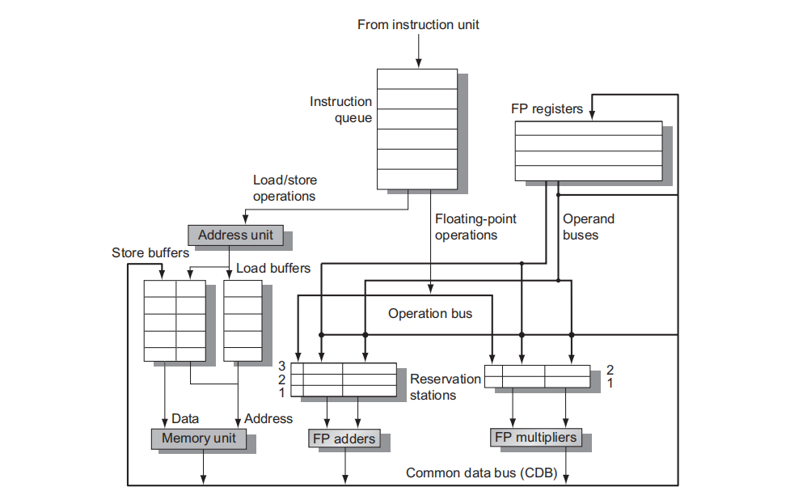
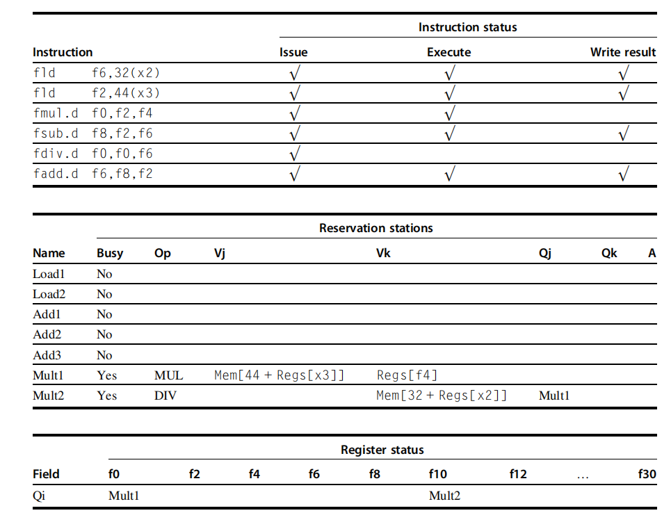
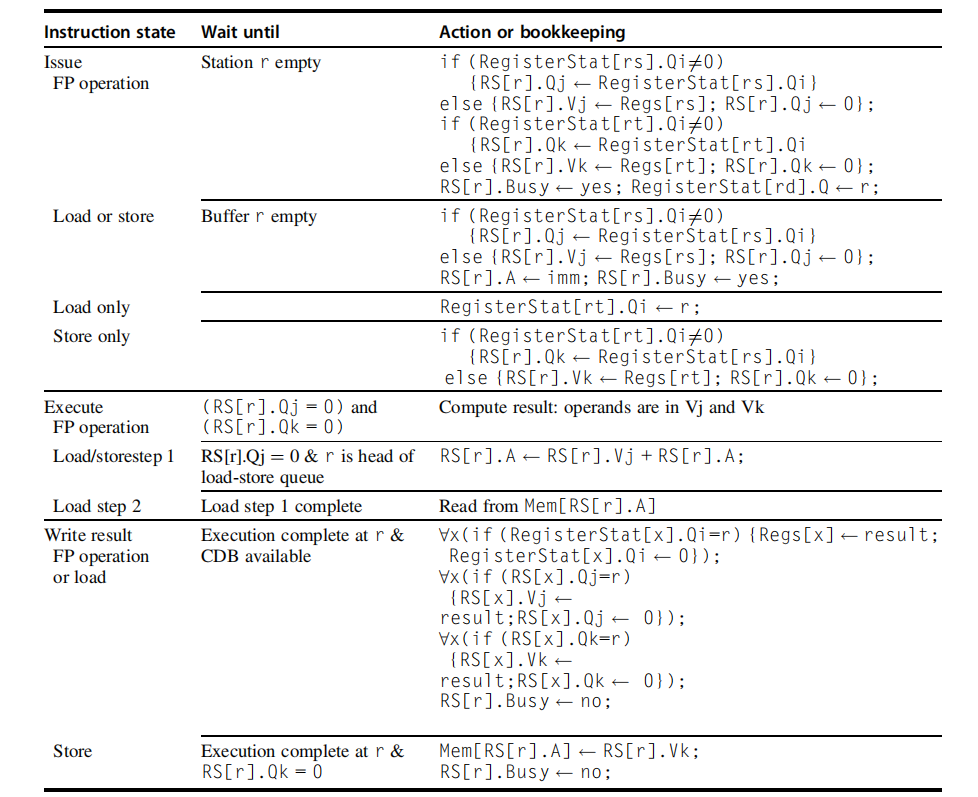
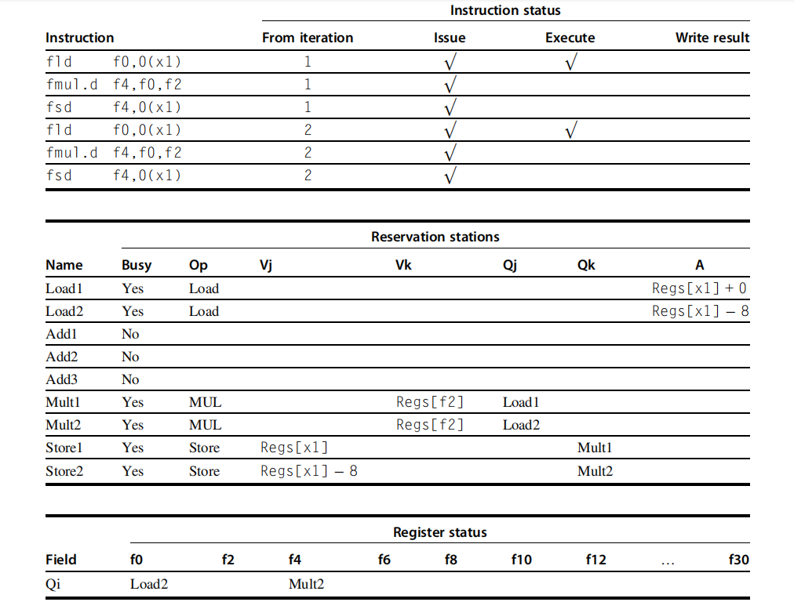
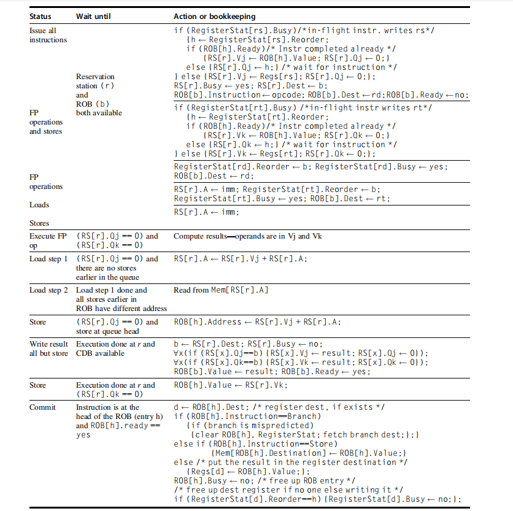

# Instruction Level Parallelism(ILP) and Its Exploitation

## Concepts and Challenges

有两个大的主题用于开发 ILP：

- 依赖于硬件去动态开发并行
- 依赖于软件在编译时静态发现
- 并行

流水线的 CPI（cycles per instruction）的值是基础 CPI 和所有产生暂停的时间的和：

Pipeline CPI = Ideal pipeline CPI + Structural stalls + Data hazard stalls + Control stalls

在本章中我们主要介绍减少 ideal pipeline CPI 的技术，这会提升解决冒险技术的重要性。

### What Is Instruction-Level Parallelism?

最简单和最普通的去提升 ILP 的方式是在循环中实现并行，这种类型的并行叫做 `loop level parallesim`，接下来是个简单的例子：

```c
for(i = 0; i <= 999; i = i+1)
    x[i] = x[i] + y[i];
```

指令集并行的技术可以通过在编译器中静态地进行展开或者在在硬件上动态执行。一个实现 `loop level parallesim` 的方法是在向量处理器或者 GPU 上面使用 SIMD。SIMD 通过并行处理少量到中等的数据项来实现数据并行。向量指令通过使用并行处理单元和深流水线来并行处理许多数据项。

### Data Dependences and Hazards

#### Data Dependeces

- 指令 i 提供的结果被指令 j 使用
- 指令 j 数据依赖于指令 k，并且指令 k 数据依赖于指令 i

一个关于数据依赖的例子：

```assembly
Loop: fld f0,0(x1) //f0=array element
      fadd.d f4,f0,f2 //add scalar in f2
      fsd f4,0(x1) //store result
      addi x1,x1," 8 //decrement pointer 8 bytes
      bne x1,x2,Loop //branch x16¼x2
```

数据依赖的两条指令必须按顺序执行不能同时执行否则会造成流水线互锁(pipeline interlocks)，流水线互锁指的是硬件去探测冒险和暂停直到冒险被清除。在一个没有 pipeline interlock 机制的处理器上只能依靠编译器调度来解决。

可以通过两种方法解决数据依赖：

- 维护依赖但是避免产生数据冒险
- 通过转换代码来消除依赖，这既可以通过编译器也可以通过硬件

数据依赖可能会发生在两个地方

- 寄存器堆，发生在这里比较好解决，因为在指令中的寄存器名字是固定的
- 内存中，这里比较难以探测，因为很可能两个地址是一样的但是看起来完全不同

#### Name Dependences

Name Dependences 指的是当两条指令使用同样的寄存器或者内存地址，但是与该名称相关的指令之间没有数据流。有两种 name dependeces，我们假设指令 i 发生在指令 j 的前面的时候来举例说明：

- antidependence: j 指令写 i 指令要读的内存地址或者是寄存器，这里必须保证 i 指令读到的是对的
- output dependence: i 和 j 指令同时写一块内存地址或者寄存器，必须保证最后的值是 j 指令写的

重命名可能是对于寄存器操作比较容易的做法，这种做法叫做寄存器重命名(register renaming)。寄存器重命名即可以被编译器来做也可以被硬件来做。

#### Data Hazards

有三种数据冒险的类型：

- RAW(read after write)：j 尝试去读取值当 i 指令写完成之前，所以 j 指令拿到了旧的值
- WAW(write after write)：j 尝试写一个值在 i 已经写完之前，最终被 i 指令写而不是被 j 指令写
- WAR(write after read)：j 尝试写在被 i 读取之前

#### Control Dependences

一个最简单的 Control Dependences:

```
if p1 {
    S1;
};
if p2 {
    S2;
}
```

- 依赖于控制的指令不能在分支之前移动分支，使其执行不再受分支控制。例如，我们不能从 if 语句的 then 部分获取指令并移动它在 if 语句之前。
- 不依赖于控制的指令不能移到后面分支，使其执行由分支控制。例如，我们不能在 if 语句之前取一个语句并将其移动到 then 部分。

一个控制依赖的例子：

```
    add x2,x3,x4
    beq x2,x0,L1
    ld x1,0(x2)
L1:
```

如果我们不注意控制依赖并将 `ld` 移到 `beq` 指令之前，加载指令可能会造成内存保护异常。

## Basic Compiler Techniques for Exposing ILP

TODO

## Reducing Branch Costs With Advanced Branch Prediction

TODO

## Overcoming Data Hazards With Dynamic Scheduling

一个简单的静态调度流水线获取一个指令然后发射它，除非在流水线中存在数据依赖的指令，并且不可以通过 bypassing/forwarding 等方法来消除。如果一个数据依赖不能被隐藏，然后数据冒险将会暂停流水线直到清除依赖关系。我们将探索一个动态调度算法从而可以减少暂停流水线。

### Dynamic Scheduling: The Idea

简单流水线的一个主要的限制是它们使用按顺序的指令发射执行，那么如果一个指令在流水线中暂停，之后的指令都得不到执行。如果一个指令 j 依赖于一个多周期的指令 i，那么在 j 之后的指令都必须等到 i 执行完之后才可以发射：

```
fdiv.d f0,f2,f4
fadd.d f10,f0,f8
fsub.d f12,f8,f14
```

在传统五级流水线中，结构和数据冒险都需要在译码阶段进行检查，如果一条指令执行没有冒险的话，当所有数据冒险解决后进行发射。

如果我们想去执行 `fsub.d` 这个指令我们必须将发射分成两部分：首先检查结构冒险和等待不存在数据冒险。因此我们仍然使用顺序发射，但是我们想要去执行指令一旦这条指令的操作数是可获得的，这样一种做法是乱序执行。乱序执行引入了 WAR 和 WAW 冒险，这些是不存在于传统五级流水线的：

```
fdiv.d f0,f2,f4
fmul.d f6,f0,f8
fadd.d f0,f10,f14
```

在 `fmul.d` 和 `fadd.d` 这两条指令之间有一个 antidependnce，如果 `fadd.d` 在 `fmul.d` 之前执行完的话，它将会造成错误，生成 WAR 冒险。相似地，为了避免 output dependence，例如在 `fdiv.d` 和 `fadd.d` 之间，WAW 冒险也必须处理。正如我们之后看到的，我们可以使用寄存器重命名消除冒险。

乱序执行也在处理异常时制造了困难。乱序执行必须保留那些使用严格的顺序执行出现的异常处理。动态调度的处理器通过延迟相关异常的通知来保持异常行为，直到处理器知道该指令应该是下一个完成的指令。尽管异常行为必须被保存，但是动态调度处理器可能会产生不精确的异常。不精确异常指的是乱序执行处理器发生的异常时的状态与顺序执行时的处理器状态不同，不精确异常可能由以下两方面造成：

- 流水线可能已经完成了发生异常之后的指令
- 流水线可能还没完成在发生异常之前的一些指令

不精确异常将会在异常后重新开始执行变得很困难，关于如何执行精确异常我们将会在之后提到。现在我们为了可以支持乱序执行，我们将五级流水线的译码阶段切分成两阶段：

- Issus: 译码，检查结构冒险
- Read operands: 等待直到没有数据冒险，然后读取操作数

首先取指 (fetch) 阶段获取指令寄存器或者待等待的指令队列，然后指令进入到发射 (issue) 阶段，将指令从寄存器或者队列中发射出去。执行阶段随后开始读取操作数，就和五级流水中相同，执行阶段可能会占用多个周期，就和在五级流水中相同。我们的处理器允许多条指令同时执行，这要求处理器有多个功能单元(functioanal units)或者流水线功能单元(pipelien functional units)或者两者皆有，这两种在流水线上本质上是等价的。

动态调度流水线都会在发射阶段顺序通过，但是可能因为产生暂停或者互相绕过(bypass) ,从而乱序进入执行阶段 。计数板算法(Socreboarding) 是一项当有充足资源并且没有数据依赖的情况下允许指令乱序执行的算法。它以开发此功能的 CDC 6600 记分牌命名。 在这里，我们专注于一种更复杂的技术，称为 Tomasulo 算法。 主要区别在于 Tomasulo 的算法通过有效地动态重命名寄存器来处理反依赖和输出依赖。 此外，Tomasulo 的算法可以扩展到处理推测，这是一种通过预测分支结果、在预测的目标地址执行指令以及在预测错误时采取纠正措施来减少控制依赖影响的技术。 虽然记分板的使用可能足以支持更简单的处理器，但更复杂、更高性能的处理器使用推测。

### Dynamic Scheduling Using Tomasulo's Approach

Tomasulo 算法被 Robert Tomasulo 所提出，可跟踪操作和指令何时可用以最小化 RAW 冒险，并在硬件中引入寄存器重命名以最小化 WAW 和 WAR 冒险。 尽管在最近的处理器中这种方案有很多变体，但它们都依赖于两个关键原则：动态确定指令何时准备好执行以及重命名寄存器以避免不必要的危险。

只有在操作数可用时才执行指令，从而避免 RAW 危害，这正是更简单的记分板方法所提供的。由名称依赖性引起的 WAR 和 WAW 冒险可以通过寄存器重命名来消除。 寄存器重命名通过重命名所有目标寄存器来消除这些危险，包括那些对于较早指令的未决读取或写入的寄存器，因此无序写入不会影响任何依赖于操作数较早值的指令。

考虑如下例子：

```
fdiv.d f0,f2,f4
fadd.d f6,f0,f8
fsd f6,0(x1)
fsub.d f8,f10,f14
fmul.d f6,f10,f8
```

有两个 `antidependences`: 在 `fadd.d` 、 `fsub.d` 和 `fsd` 、`fmul.d` 指令之间。也有一个 `output dependences` : `fadd.d` 和 `fmul.d` 之间，前者是 WAR，后者是 WAW。同时还有几个真实的数据依赖（前面并不存在真实的数据依赖，只是乱序执行时有可能数据错了）。因此我们可以将寄存器重命名为:

```
fdiv.d f0,f2,f4
fadd.d S,f0,f8
fsd S,0(x1)
fsub.d T,f10,f14
fmul.d f6,f10,T
```

此外，f8 的任何后续使用都必须替换为寄存器 T。在此示例中，重命名过程可以由编译器静态完成。 查找代码后面的 f8 的任何使用需要复杂的编译器分析或硬件支持，因为在前面的代码段和 f8 的后续使用之间可能存在中间分支。 正如我们将看到的，Tomasulo 的算法可以处理跨分支的重命名。

下图展示了 Tomasulo 处理器的基础结构：



上图包含了浮点数单元和 load/store 单元，没有显示任何执行控制表。每个 reservation station 都持有一条已经被发射的指令，并等待功能单元执行。如果已经计算了该指令的操作数值，则它们也存储在该条目中； 否则，reservation station 条目保存将提供操作数值的保留站的名称。加载缓冲区和存储缓冲区保存来自和去往内存的数据或地址，其行为几乎与 reservation station 完全相同，因此我们仅在必要时区分它们。 浮点寄存器通过一对总线连接到功能单元，并通过一条总线连接到存储缓冲区。来自功能单元和内存的所有结果都在公共数据总线上发送，除了加载缓冲区外，该总线无处不在。 所有保留站都有标签字段，由流水线控制使用。

在我们正式介绍算法前我们先看看指令的 3 个流程，每个流程可能占用任意个周期：

- Issue: 从 FIFO 指令队列的头部获取下一条指令，以此维护指令的顺序性。如果有一个匹配的 reversation station 是空的，发射该指令和对应的操作数值（如果它们当前在寄存器中）到对应的 reversation station。如果没有空的 reservation station，则表明有结构相关冒险，然后该指令暂停直到 station 或者 buffer 被释放。如果操作数不在寄存器中，则跟踪会产生操作数的功能单元，在这一步进行寄存器重命名。

- Execute: 如果一个或多个操作数尚不可用，则在等待计算公共数据总线时监视它。 当一个操作数变得可用时，它被放置到任何等待它的保留站中。 当所有操作数都可用时，就可以在相应的功能单元执行操作。 通过延迟指令执行直到操作数可用，避免了 RAW 冒险。
  
    注意到可能几个指令在相同时钟周期内同样的功能单元同时准备好。尽管独立的功能单元可能在相同周期执行不同的指令，但是如果在相同的功能单元中有超过一条指令准备好了的话，该单元将从它们中选择一个。对于浮点数保留站，选择可能是任意的。但是对于加载和存储指令，情况则有些复杂。
  
    加载和存储指令需要两步骤执行：当基寄存器可获得时计算地址，然后该地址被放入加载或存储缓冲区中(load or store buffer)。当内存单元可获得时在 load buffer 中的加载指令立刻执行。存储指令存储在 store buffer 中直到值被送入内存单元。加载和存储指令保持程序顺序以防冒险。
  
    为了保持异常行为，在程序顺序中位于指令之前的分支完成之前，不允许任何指令启动执行。Speculation 提供了一种更灵活、更完整的方法来处理异常，因此我们将延迟进行此增强，并在稍后展示 Speculation 如何处理此问题。

- Write result：当结果可获得时，将其写到 CDB 总线中和从那些寄存器或者保留站中等待结果。存储指令缓存在 store buffer 中存储地址可获得并且值已经被存储了，然后将结果写入当内存单元是空闲的时候。

在 Tomasulo 算法和接下来要介绍的 speculation 中，结果被广播在 CDB 总线上，而 CDB 总线则由保留站所监测。

重要的是记住在 Tomasulo 算法中 tag 是指将产生结果的 buffer 或者 unit。当指令被发射到保留站中寄存器名字就被丢弃了。每个保留站有 7 个域：

- Op：对源操作数 S1 和 S2 执行的操作
- Qj, Qk：保留站将产生相关的源操作数；0 表示源操作数可以在 Vj 或者 Vk 中获得或者没有必要
- Vj, Vk：源操作数的值。对于每个操作，仅仅 V 域或者是 Q 域是有效的。对于加载指令，Vk 域被用于存放 offset 域
- A：用于保存用于加载或存储的内存地址计算的信息。 最初，指令的立即字段存储在这里； 地址计算完成后，有效地址就存放在这里。
- Busy：表明该保留站及其附属的功能单元已被占用

register file 有一个 field:

- Qi：包含其结果应存储到该寄存器中的操作的保留站的编号。 如果 Qi 的值为空白（或 0），则当前没有活动指令正在计算以该寄存器为目标的结果，这意味着该值只是寄存器内容。

加载和存储 buffer 都有一个域，A，放置第一步计算的 effective address 的结果。

## Dynamic Scheduling: Examples and the Algorithm

```
1. fld f6,32(x2)
2. fld f2,44(x3)
3. fmul.d f0,f2,f4
4. fsub.d f8,f2,f6
5. fdiv.d f0,f0,f6
6. fadd.d f6,f8,f2
```

Tomasolu 算法有两方面的优势：

- The distribution of the hazard detection logic
- The elimination of stalls for WAW and WAR hazards

第一个优势来自于保留站和 CDB 的使用。如果多条指令正在等待单个结果，并且每条指令有其他的操作数，然后这些指令可以并行地进行释放当这些结果在 CDB 上面广播之后。如果使用集中寄存器文件，这些单元将不得不读取寄存器当寄存器总线可用时。

第二个优点，即消除 WAW 和 WAR 危险，是通过使用保留站重命名寄存器以及通过在操作数可用时将其存储到保留站的过程来实现的。

举例来说，`fdiv.d` 指令和 `fadd.d` 指令在 `f6` 寄存器上有一个 WAR 冒险。这个冒险通过两个方式来消除。首先，如果为 `fdiv.d` 提供值的指令已经完成，那么 Vk 将存储结果，允许 `fdiv.d` 独立于 fadd.d 执行（这是所示的情况）。 另一方面，如果 `fld` 还没有完成，那么 Qk 将指向 `Load1` 预留站，`fdiv.d` 指令将独立 `fadd.d`。 因此，无论哪种情况，`fadd.d` 都可以发出并开始执行。 对 `fdiv.d` 结果的任何使用都将指向保留站，从而允许 fadd.d 完成并将其值存储到寄存器中而不影响 `fdiv.d`。


我们将在之后看到一个 WAW 冒险的例子，首先先假定: 

- load 1 周期
- add 2 周期
- multiply 6 周期
- divide 12 周期



在这个例子中 `fadd.d` 指令已经执行完毕因为 `fdiv.d` 把操作数拷贝了过来，因此解决了 WAR 冒险。

### Tomasulo's Algorithm: The Details

如前所述，在进行独立的加载或存储缓冲区之前，加载和存储通过一个功能单元进行有效的地址计算。 加载执行第二个步骤以访问内存，然后转到写入将值从内存发送到寄存器文件和/或任何等待的保留站的结果。 存储在写入结果阶段完成其执行，该阶段将结果写入内存。 请注意，所有写入都发生在 Write Result 中，无论目标是寄存器还是内存。 这个限制简化了 Tomasulo 的算法。

### Tomasulo's Algorithm: A Loop-Based Example

```
Loop: 
    fld f0,0(x1)
    fmul.d f4,f0,f2
    fsd f4,0(x1)
    addi x1,x1," 8
    bne x1,x2,Loop // branches if x1 != x2
```

下图表示不同类型的指令在发射和执行等过程的流程：





- load 指令在 store 指令前，并且交换它们会造成 WAR 冒险
- store 指令在 load 指令前，并且交换它们会造成 RAW 冒险
- 交换两个同样地址的 store 指令会造成 WAW 冒险

因此，为了确定是否可以在给定时间执行加载，处理器可以检查在程序顺序中加载之前的任何未完成存储是否与加载共享相同的数据存储器地址。 类似地，存储必须等到没有未执行的加载或存储在程序顺序中较早并共享相同的数据存储器地址。 我们在之后考虑了一种消除这种限制的方法。

为了检测这种危险，处理器必须已经计算出与任何早期存储器操作相关的数据存储器地址。 保证处理器具有所有这些地址的一种简单但不一定是最佳的方法是按程序顺序执行有效地址计算。 （我们实际上只需要保持存储和其他内存引用之间的相对顺序；也就是说，加载可以自由地重新排序。）

让我们首先考虑加载的情况。 如果我们按照程序顺序进行有效地址计算，那么当一次加载完成有效地址计算后，我们可以通过检查所有活动存储缓冲区的 A field 来检查是否存在地址冲突。 如果加载地址与存储缓冲区中某些活动条目的地址匹配，则在冲突存储完成之前，该加载指令不会发送到加载缓冲区。 （一些实现将值直接绕过从挂起存储加载，从而减少此 RAW 危险的延迟。）

存储操作类似，除了处理器必须检查加载缓冲区和存储缓冲区中的冲突，因为冲突的存储不能相对于加载或存储重新排序。

动态调度流水线可以产生非常高的性能，前提是准确预测分支——这是我们在上一节中解决的问题。 这种方法的主要缺点是 Tomasulo 方案的复杂性，它需要大量的硬件。 特别是，每个保留站必须包含一个关联缓冲区，该缓冲区必须高速运行，以及复杂的控制逻辑。 性能也可能受到单个 CDB 的限制。 尽管可以添加额外的 CDB，但每个 CDB 必须与每个保留站交互，并且必须在每个站为每个 CDB 复制关联的标签匹配硬件。 在 1990 年代，只有高端处理器才能利用动态调度（及其对推测的扩展）； 然而，最近甚至为 PMD 设计的处理器也在使用这些技术，并且用于高端台式机和小型服务器的处理器具有数百个缓冲区来支持动态调度。

## Hardware-Based Speculation

实现 hardware speculation 的关键点是要允许指令乱序执行但是需要强迫它们顺序提交并且阻止任何不可撤销的行为（例如更新状态或者发生异常）直到指令提交。因此我们需要添加 commit 阶段，添加 commit 阶段需要添加额外的硬件缓冲区用来放置已经完成结果但还没有 commit 的指令，添加的 buffer 我们叫它 **reorder buffer(ROB)**。

ROB 和保留站提供寄存器的方式相同。ROB 保存与指令相关的操作完成时间和指令提交时间之间的指令结果。 因此，ROB 是指令操作数的来源，就像保留站在 Tomasulo 算法中提供操作数一样。关键区别在于，在 Tomasulo 的算法中，一旦一条指令写入其结果，所有后续发出的指令都会在寄存器文件中找到结果。 通过推测，寄存器文件在指令提交之前不会更新（我们明确知道该指令应该执行）； 因此，ROB 在指令执行完成和指令提交之间提供操作数。 ROB 类似于 Tomasulo 算法中的存储缓冲区，为了简单起见，我们将存储缓冲区的功能集成到 ROB 中。


ROB 包含四个fields: 

- instruction type
- destination field
- value field
- ready field

在指令执行过程中有 4 步：

- Issue: 从指令队列中拿到一条指令。如果有一个空的保留站和一个空的 ROB 位置则发射。将操作数送到 ROB 如果它们在寄存器或者 ROB 里面可获得。更新控制条目以指示缓冲区正在使用中。 为结果分配的 ROB 条目的编号也被发送到保留站，以便在将结果放在 CDB 上时可以使用该编号来标记结果。 如果所有预留都已满或 ROB 已满，则指令发出将停止，直到两者都有可用条目。
- Execute: 如果有一个或者多个操作数是不可获得的，检测 CDB 直到等到所有寄存器被算完。当在保留站中的所有操作数都可获得执行操作。
- Write results: 当结果可用时，将其写入 CDB（发出指令时发送 ROB 标签）并从 CDB 写入 ROB，以及任何等待该结果的保留站。 将保留站标记为可用。 Store 指令需要特殊操作。 如果要存储的值可用，则将其写入存储的 ROB 条目的 Value 字段。 如果要存储的值尚不可用，则必须监视 CDB，直到该值被广播，此时存储的 ROB 条目的 Value 字段被更新。 为简单起见，我们假设这发生在写入结果阶段的 store； 我们稍后讨论放宽这个要求。
- Commit: 这是完成指令的最后阶段，之后只剩下它的结果。 （一些处理器将此提交阶段称为“完成”或“毕业”。）根据提交指令是具有不正确预测的分支、存储还是任何其他指令（正常提交），提交时有三种不同的操作序列 . 正常的提交情况发生在一条指令到达 ROB 的头部并且其结果存在于缓冲区中时； 此时，处理器用结果更新寄存器并从 ROB 中删除指令。 除了更新内存而不是结果寄存器之外，提交存储是类似的。 当预测错误的分支到达 ROB 的头部时，表明推测错误。 ROB 被刷新并在分支的正确后继处重新开始执行。 如果分支被正确预测，则分支完成。一旦一条指令提交，它在 ROB 中的条目就会被回收，并且寄存器或内存目标会被更新，从而不再需要 ROB 条目。 如果 ROB 被填满，我们只需停止发出指令，直到条目空闲为止。

Hardware Speculation 方法除了加上 ROB 并加上了提交阶段其他部分与 Tomasulo 算法相同：



这里简要描述一下：

- 发射阶段：当发现对应空闲指令类型的保留站和 ROB 的时候则执行发射。发射过程首先检查两个操作数，若两个操作数寄存器的状态都为空闲，则将其放入 Vj, Vk 中，否则检查对应的 ROB，若当前寄存器的 ROB 计算已经完成但没有提交，则和之前步骤相同，否则则将 Qj/Qk 设置为对应 ROB 的编号
- 执行阶段：当对应的操作数可获得时进行之星
- 写回阶段：将计算结果通过 CDB 广播到所有保留站中，并更新寄存器状态和 ROB。
- 提交阶段：若队列顶 ROB 已准备好，则将其 pop 出来并写回寄存器。然后释放 ROB。
