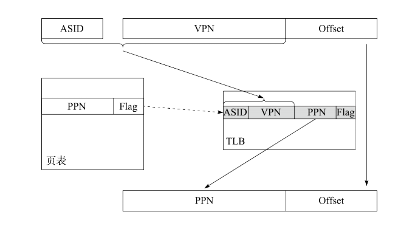

# TLB MMU

处理器的存储管理部件（MMU）支持虚实地址转换、多进程空间等功能，是通用处理器体现 "通用性" 的重要单元，也是处理器和操作系统交互最密切的部分。

## 存储管理原理

- 隐藏和保护
- 为程序分配连续的内存空间
- 扩展地址空间
- 节约物理内存

在 32 位系统中，采用 4 KB 页时，单个完整页表需要 1M 项，对每个进程维护页表需要相当可观的空间代价，因此页表只能放在内存中。若每次进行地址转换时都需要先查询内存，则会对性能产生明显的影响。为了提高页表访问的速度，现代处理器通常包含一个转换后援缓冲器(Translation Lookaside Buffer，TLB)来实现快速的虚实地址转换。TLB 也称页表缓存或者快表，借由局部性原理，存储当前处理器中最近常访问页的页表。一般 TLB 访问与 Cache 访问同时进行，而 TLB 也可以被视为页表的 Cache。TLB 中存储的内容包括虚拟地址、物理地址和保护位，可分别对应于 Cache 的 Tag、Data 和 状态位。

TLB 转换过程如下图所示：



处理器用地址空间标识符(Address Space Identifier，简称 ASID) 和虚拟页号(VPN) 在 TLB 中进行查找匹配，若命中则读出其中的物理页号(PPN) 和标志位(Flag)。标志位用于判断访问是否合法，一般包括是否可读、是否可写、是否可执行等，若非法则发出非法访问异常；物理页号用于和页内偏移拼接组成物理地址。若未在 TLB 中命中，则需要将页表内容从内存中取出并填入 TLB 中，这一过程通常称为 TLB 重填(TLB Refill)。TLB 重填可有硬件或软件进行，例如 x86、ARM 处理器使用硬件 TLB 重填，即由硬件完成页表遍历(Page Table Walker)，将所需的页表项填入 TLB 中，而 MIPS处理器默认使用软件 TLB 重填，即查找 TLB 发现不命中时，将触发 TLB 重填异常，由异常处理程序进行页表遍历并进行 TLB 填入。

## MIPS TLB Virtual Address Translation

### Address Space Identifiers(ASID)

ASID 是操作系统用于对于不同的进程分配的标识符从而可以访问独一无二的虚拟空间。在某些特殊的情况下，操作系统可能希望所有进程的某一块虚拟地址关联到同一块物理地址，因此 TLB 包括一个 glocal(G) 标志位，该位在 TLB 转换时覆盖 ASID comparison。

### TLB 结构

TLB 是一个用于翻译虚拟地址的全相联结构。每个 entry 有两个逻辑组成部分：一个比较段(comparison section) 和一个物理翻译段(physical tracslation section)。比较段包含虚拟页号(VPN2，ASID 和 G 标志位 和一个推荐的 mask field 用于应设不同大小的 page size)。物理翻译段包含两个 entries，每个 entry 包含物理页帧号(page frame number, PFN) 和一个 valid 标志位(V)和一个 dirty(D) 标志位，可选的 read-inhibit 和 execute-inhibit (RX & XI) 标志位和一个缓存一致性(cache coherency，C) 标志位。TLB 的物理页翻译段有两个 entries 因为每个 TLB entry 映射一对对齐的虚拟地址和一对物理翻译 entry 对应于该对的偶数页和奇数页。这两个虚地址页一定连续的，所以可以压缩它们的存储空间，即只存储 19 位的 VPN2，对应的是 `{VPN2, 1'b0}` 和 `{VPN2, 1'b1} ` 这两个虚页号。两个页的对应关系是 `{VPN2, 1'b0} -> PFN0` 和 `{VPN2, 1'b1} -> PFN1`。

一个最简单的 MIPS TLB 的结构如下所示：

```
-------------------------------------------------------------------------
|   VPN2   |   ASID   |  G  |  PFN0  |  C0,D0,V0  |  PFN1  |  C1,D1,V1  |
-------------------------------------------------------------------------
|  19bit   |   8bit   | 1bit|  20bit |  5bit      |  20bit |  5bit      |
-------------------------------------------------------------------------
```

MIPS 手册里给的图如下所示:


### TLB 初始化

再许多处理器实现中，软件必须在上电过程中初始化 TLB。在检测多个 TLB 匹配并通过机器检查假设发出信号的处理器中，软件必须准备好处理此类异常或使用 TLB 初始化算法来最小化或消除执行的可能性。

接下来的例子展示了软件如何初始化 TLB:

```assembly
/*
* InitTLB
*
* Initialize the TLB to a power-up state, guaranteeing that all entries
* are unique and invalid.
*
* Arguments:
* a0 = Maximum TLB index (from MMUSize field of C0_Config1)
*
* Returns:
* No value
*
* Restrictions:
* This routine must be called in unmapped space
*
* Algorithm:
* va = kseg0_base;
* for (entry = max_TLB_index; entry >= 0, entry--) {
* while (TLB_Probe_Hit(va)) {
* va += Page_Size;
* }
* TLB_Write(entry, va, 0, 0, 0);
* }
*
* Notes:
* - The Hazard macros used in the code below expand to the appropriate
* number of SSNOPs in an implementation of Release 1 of the
* Architecture, and to an ehb in an implementation of Release 2 of
* the Architecture. See , “CP0 Hazards,” on page 79 for
* more additional information.
*/
InitTLB:
/*
* Clear PageMask, EntryLo0 and EntryLo1 so that valid bits are off, PFN values
* are zero, and the default page size is used.
*/
mtc0 zero, C0_EntryLo0 /* Clear out PFN and valid bits */
mtc0 zero, C0_EntryLo1
mtc0 zero, C0_PageMask /* Clear out mask register *
/* Start with the base address of kseg0 for the VA part of the TLB */
la t0, A_K0BASE /* A_K0BASE == 0x8000.0000 */
/*
* Write the VA candidate to EntryHi and probe the TLB to see if if is
* already there. If it is, a write to the TLB may cause a machine
* check, so just increment the VA candidate by one page and try again.
*/
10:
mtc0 t0, C0_EntryHi /* Write VA candidate */
TLBP_Write_Hazard() /* Clear EntryHi hazard (ssnop/ehb in R1/2) */
tlbp /* Probe the TLB to check for a match */
TLBP_Read_Hazard() /* Clear Index hazard (ssnop/ehb in R1/2) */
mfc0 t1, C0_Index /* Read back flag to check for match */
bgez t1, 10b /* Branch if about to duplicate an entry */
addiu t0, (1<<S_EntryHiVPN2) /* Add 1 to VPN index in va */
/*
* A write of the VPN candidate will be unique, so write this entry
* into the next index, decrement the index, and continue until the
* index goes negative (thereby writing all TLB entries)
*/
mtc0 a0, C0_Index /* Use this as next TLB index */
TLBW_Write_Hazard() /* Clear Index hazard (ssnop/ehb in R1/2) */
tlbwi /* Write the TLB entry */
bne a0, zero, 10b /* Branch if more TLB entries to do */
addiu a0, -1 /* Decrement the TLB index
/*
* Clear Index and EntryHi simply to leave the state constant for all
* returns
*/
mtc0 zero, C0_Index
mtc0 zero, C0_EntryHi
jr ra /* Return to caller */
nop
```

### 地址翻译

当地址翻译发生时，所有的 TLB 项会被同时检查并获得一个匹配，当接下来的情况发生则表明匹配成功（我们这里暂时不考虑页大小可变）：

- 当前进程的 ASID (即 CP0 的 EntryHi 寄存器) 和 TLB 中的 ASID 位相同，或者当前 TLB 项中包含 G 标志位
- 地址的虚拟页号和储存在 TLB 项中的 VPN2 域相同。

一个 TLB 查找算法的伪代码如下：

```
va = Virtual Address
for i in 0..TLBEntries-1:
	if(TLB[i].VPN2 = va31..13) && (TLB[i].G | TLB[i].ASID = EntryHi.ASID){
		if va12 = 0 {
			pfn = TLB[i].PFN0
			v = TLB[i].V0
			c = TLB[i].C0
			d = TLB[i].D0
		}else{
			pfn = TLB[i].PFN1
			v = TLB[i].V1
			c = TLB[i].C1
			d = TLB[i].D1
		}
		
		if v = 0 then
			SignalException(TLBInvalid, reftype)
		endif
		
		if(d = 0) && (reftype = store) then
			SignalException(TLBModified)
		endif
		
		pa = pfn19..0 || va11..0
		found = 1
	}
	
	if found = 0 then
		SignalException(TLBMiss, reftype)
	endif
```

### TLB 软件访问

我们观察 TLB 项的内容发现每一项都大于 32 位，这意味着从寄存器或者内存直接获得 TLB 读出或写入的数据都不太方便。除此之外，TLB 查找表的项数也可多可少，因此读写访问所用的地址也应该是可配置的。于是，MIPS 指令系统定义了一系列 CP0 寄存器，由他们直接和 TLB 进行交互，这些 CP0 寄存器自身又可以通过 MFC0、MTC0 指令与通用寄存器进行交互。

相关的寄存器如下所示：

```
EntryHi:
--------------------------------------------
|  VPN2 31..13  |  0 12..8  |  ASID  7..0  |
--------------------------------------------
EntryLo0:
------------------------------------------------------------
|  0 31..26  | PFN0  25..6  | C0 5..3 | D0 2 | V0 1 | G0 0 |
------------------------------------------------------------
EntryLo1:
------------------------------------------------------------
|  0 31..26  | PFN1  25..6  | C1 5..3 | D1 2 | V1 1 | G1 0 |
------------------------------------------------------------
```

- 在读写 TLB 的时候，EntryHi 的 ASID 对应被访问项的 ASID 域；在查询 TLB 的时候，EntryHi 的 ASID 域是作为查询值中的 ASID 信息。
- 在写 TLB 的时候，EntryLo0 的 G0 和 EntryLo1 的 G1 相与，结果作为被写入项的 G 位值；在读 TLB 的时候，被读出项的 G 位值同时填入 EntryLo0 的 G0 和 EntryLo1 的 G1。

前面 3 个寄存器与 TLB 页表有关，访问 TLB 的第几项则在 Index 寄存器中定义：

```
----------------------------------------------------------------
|  P 31  |  0  30..n   |             Index n-1..0              |
----------------------------------------------------------------
```

该寄存器中的 Index 位宽与所实现的 TLB 项数有关。当 TLB 为 16 项时，Index 域为 4 位宽。在读写 TLB 时，Index 寄存器表示指示访问第几项，在查找时表示在第几项命中。P 标志位仅与查找相关，当查找命中，标志位为 0 ，否则为 1。

### TLB 软硬件交互机制

- TLB 重填例外 当 TLB 未查找到页表项
- TLB 无效例外 在 TLB 查找到页表项，对应物理页 V 为 0
- TLB 修改例外 在 TLB 查找到页表项，对应物理页 V 为 1，D 为 0，且该访问是 store

## References

- 计算机体系结构基础
- MIPS Architecture For Programmers Volume III
- CPU 设计实战

