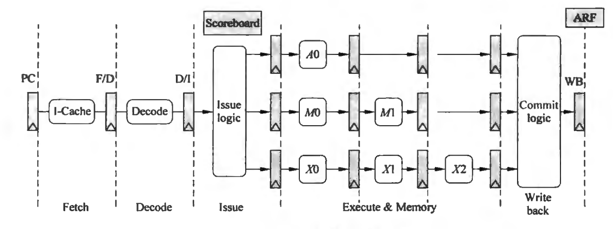
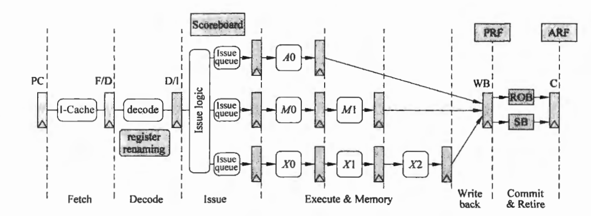

# 超标量处理器概览

## 为什么需要超标量

加快处理器速度的方法：

- 减少程序指令数量
- 减少每条指令在处理器中执行所需要的周期数
- 减少处理器周期时间

## 普通流水线

普通五级流水线，各个阶段执行时间不同，方法：

- 合并流水线
- 拆分流水线

指令之间存在各种相关性，使它们无法完全地乱序执行。

## 超标量处理器的流水线

如果一个处理器每周期可以取出多于一条指令送到流水线执行，并且使用硬件来对指令进行调度，那么这个处理器就可以称为超标量处理器了，从本质上来讲，超标量处理器有两种方式可以执行指令，顺序执行和乱序执行。

### 顺序执行

将发射阶段单独提出来提高性能，顺序执行的所有 `FU` 必须是相同周期的，因为必须是顺序执行。

### 乱序执行

乱序执行引入了发射队列(Issue Queue, IQ)来储存指令，当指令的操作数准备好了，就可以执行发射。为了保证指令的顺序执行，在提交阶段引入了重排序缓存(ROB)，在程序中所有的指令都按照规定的顺序存储在重排序缓存中。引入 SB (Store Buffer) 在写回阶段时并不实际写入存储器，而是写入 SB，因为倘若指令提交时发生异常，存储器的状态无法修改。除此之外，为了解决指令相关性问题，还需要引入寄存器重命名。注意：乱序执行并不是一直乱序，只有在执行阶段是乱序的，最后在提交的时候依然是顺序提交的。