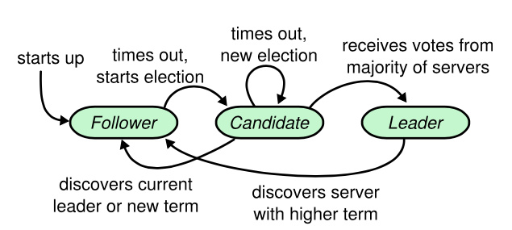

# Lab-2A Leader Election


### Lab-2A Leader election
根据论文，任何服务器节点都处于三种状态之一：领导人、跟随者或者候选人。      

Raft 把时间分割成任意长度的任期，任期使用连续的整数标记。每一段任期从一次选举开始，此时一个或多个候选人尝试成为领导者。如果一个候选人赢得选举，他就在接下来的任期内充当领导者的责任。在某些情况下，一次选举过程会造成选票的瓜分。在这种情况下，这一任期以没有领导人结束；一个新的任期（和一次新的选举）会很快重新开始。Raft 保证了在一个给定的任期内，最多只有一个领导者。 



Raft 采用心跳机制来触发领导人选举，当服务器程序启动时，他们都是跟随者身份。一个服务器节点继续保持着跟随者状态只要他从领导人或者候选者获取有效的 RPC。 领导人周期性向所有跟随者发送心跳包（即不包含日志项内容的附加日志项 RPCs）来维持自己的权威。如果一个跟随者在一定时间内没有接收到消息，他就会认为系统中没有可用的领导人，从而重新发起选举。  

跟随者会通过增加自己的任期号，并向即群众其他服务器节点发送请求投票。当一个候选人从大多数服务器节点获得了针对同一个任期号的选票，那么他就赢得了这次选举并成为领导人，其中每个服务器只能投出一张选票，当服务器成为领导人后会立即向所有节点发送心跳包来维护自己的权威。 

在等待投票的时候，候选人可能会从其他的服务器接收到声明它是领导人的附加日志项 RPC。如果这个领导人的任期号（包含在此次的 RPC中）不小于候选人当前的任期号，那么候选人会承认领导人合法并回到跟随者状态。 如果此次 RPC 中的任期号比自己小，那么候选人就会拒绝这次的 RPC 并且继续保持候选人状态。

第三种可能的结果是候选人既没有赢得选举也没有输：如果有多个跟随者同时成为候选人，那么选票可能会被瓜分以至于没有候选人可以赢得大多数人的支持。当这种情况发生的时候，每一个候选人都会超时，然后通过增加当前任期号来开始一轮新的选举。然而，没有其他机制的话，选票可能会被无限的重复瓜分。

Raft 算法使用随机选举超时时间的方法来确保很少会发生选票瓜分的情况，就算发生也能很快的解决。为了阻止选票起初就被瓜分，选举超时时间是从一个固定的区间（例如 150-300 毫秒）随机选择。这样可以把服务器都分散开以至于在大多数情况下只有一个服务器会选举超时；然后他赢得选举并在其他服务器超时之前发送心跳包。同样的机制被用在选票瓜分的情况下。每一个候选人在开始一次选举的时候会重置一个随机的选举超时时间，然后在超时时间内等待投票的结果；这样减少了在新的选举中另外的选票瓜分的可能性。

**实现思路：**  

首先，在所有服务器启动时会异步启动一个 goroutine 来随机计时，当计时时间到了的时候跟随者会成为候选人并向其他服务器节点发送选票，这里我们需要遍历所有除自己的服务器节点，并为每个节点启动一个 goroutine 发送选票。当等待所有选票回复后则查看自己选票数，倘若赢得大多数选票则自动成为领导人并向其他节点发送心跳包，否则自动成为追随者并设置任期时长。  

在 `ticker` 中，我们需要设定随机的休眠时间，在休眠过后判断最近是否接收到心跳包，如果未接收到则表明选举超时，此时需要去向其他服务器节点周期性地发送选举请求，直到发生以下情况：
- 自己成为了leader
- 收到其他节点发送来的心跳包
- 该任期内无 leader，变成候选人重新开启选举 
  

同时，我们也需要异步检查自己的状态是否是 leader 并向其他节点周期性地发送心跳包

Raft 的结构定义由论文的 Figure2 定义如下：
```golang
type Raft struct {
	mu        sync.Mutex          // Lock to protect shared access to this peer's state
	peers     []*labrpc.ClientEnd // RPC end points of all peers
	persister *Persister          // Object to hold this peer's persisted state
	me        int                 // this peer's index into peers[]
	dead      int32               // set by Kill()

	// Your data here (2A, 2B, 2C).
	// Look at the paper's Figure 2 for a description of what
	// state a Raft server must maintain.

	// 状态参数
	// 服务器已知最新任期（在服务器首次启动的时候初始化为0，单调递增）
	CurrentTerm int
	// 当前任期内收到选票的候选人id，如果没有投给人和候选者，则为空
	VotedFor int
	// 日志条目，每个条目包含了用于状态机的命令，以及领导者接收到该条目时的任期（第一个索引为1）
	Log []LogEntry

	// 服务器上的易失性状态
	// 已知已提交的最高的日志条目的索引（初始值为0，单调递增）
	CommitIndex int
	// 已经被应用到状态机的最高的日至条目的索引（初始值为0，单调递增）
	LastApplied int
	// 领导者（服务器）上的易失性状态（选举后已经重新初始化）
	// 对于每一台服务器，发送到该服务器的下一个日志条目的索引（初始值为领导者最后的日志条目的索引 + 1）
	NextIndex []int
	// 对于每一台服务器，已知的已经复制到该服务器的最高日志条目的索引（初始值为0，单调递增）
	MatchIndex []int

	// 记录此台服务器的状态
	State int
	// 记录此台服务器上次接收心跳检测的时间
	HeartBeat time.Time
}
```

`ticker` 的实现如下所示:
```golang
// The ticker go routine starts a new election if this peer hasn't received
// heartsbeats recently.
func (rf *Raft) ticker() {
	for !rf.killed() {

		// Your code here to check if a leader election should
		// be started and to randomize sleeping time using
		// time.Sleep().

		electionTimeout := rf.getelectionTimeout()
		time.Sleep(electionTimeout)

		duration := time.Since(rf.getHeartBeatTime())

		// 如果超过选举超时时间没有接收到心跳包，则变成候选者发起选举
		if duration > electionTimeout {
			DPrintf("[Debug] Server%v选举超时\n", rf.me)
			DPrintf("[Debug] electionTimeout: %v duration: %v\n", electionTimeout, duration)
			rf.election()
		} else if rf.State != Leader {
			// 如果接到了心跳包则变成追随者
			DPrintf("[Debug] Server%v为Follower.\n", rf.me)
			continue
		} else {
			DPrintf("[Debug] Server%v仍为Leader.\n", rf.me)
		}
	}
}
```
`ticker()` 首先获取随机的选举超时时间，随后进入休眠，当选举超时时获取最近的一次获取心跳检测的时间，并来判断在选举超时时间内有没有接收到心跳包，若没有则转换为候选人并开始一次选举`election()`:
```golang
// 候选人发起选举
func (rf *Raft) election() {
	// 发起选举，首先增加自己的任期
	DPrintf("[election] 开始选举.\n")
	DPrintf("[election] 更新任期.\n")
	rf.ConvertTo(Candidates)
	// rf.CurrentTerm += 1
	// 并行地向除自己的服务器索要选票
	// 如果没有收到选票，它会反复尝试，直到发生以下三种情况之一：
	// 1. 获得超过半数的选票；成为 Leader，并向其他节点发送 AppendEntries 心跳;
	// 2. 收到来自 Leader 的 RPC， 转为 Follwer
	// 3. 其他两种情况都没发生，没人能够获胜（electionTimeout 已过）：增加 currentTerm,
	// 开始新一轮选举
	for {
		if !rf.killed() {
			wg := new(sync.WaitGroup)
			// wg.Add(len(rf.peers))
			// 如果当前节点没有宕机并且仍为候选人时周期性地向所有节点发送投票请求
			nVote := 1
			for i := 0; i < len(rf.peers); i++ {
				if i != rf.me {
					wg.Add(1)
					go func(server int) {
						rf.mu.Lock()
						req := RequestVoteArgs{}
						reply := RequestVoteReply{}
						// 初始化请求的参数
						req.Term = rf.CurrentTerm
						req.CandidateId = rf.me
						rf.mu.Unlock()
						if rf.sendRequestVote(server, wg, &req, &reply) {
							rf.mu.Lock()
							defer rf.mu.Unlock()
							if rf.CurrentTerm != req.Term {
								return
							}
							if reply.Term > rf.CurrentTerm {
								rf.CurrentTerm = reply.Term
								rf.ConvertTo(Follower)
							}
							if reply.VoteGranted {
								DPrintf("[sendRequestVote] Server%v承认%v\n", server, rf.me)
								nVote += 1
								if nVote > len(rf.peers)/2 && rf.State == Candidates {
									// 获得超过半数的选票，成为 Leader
									rf.ConvertTo(Leader)
									DPrintf("[Debug] Server%v得到超过半数选票，成为Leader\n", rf.me)
									return
								}
							}
						} else {
							if rf.CurrentTerm < reply.Term {
								rf.ConvertTo(Follower)
								rf.CurrentTerm = reply.Term
							}
						}

					}(i)
				}
			}
			wg.Wait()
		} else {
			return
		}
		// 休息一段时间再向服务器节点发送投票请求
		duration := time.Millisecond * 100
		time.Sleep(duration)
	}
}
```

在 `election()` 函数中，他会周期性地并发地向所有节点发送选举请求，只有当以下情况发生时结束选举：
- 获得超过半数选票，成为 Leader
- 收到其他 Leader 发来的心跳检测包，成为 Follower
- 该任期内没有节点成为 Leader，选举超时进入下一个任期
  

其中，接收到选票的节点需要根据选票的信息来为候选人投票，只有候选人的任期大于自己的任期并且当前节点没有为任何节点投票或者为该节点投过票时才为其投票:
```golang
func (rf *Raft) RequestVote(args *RequestVoteArgs, reply *RequestVoteReply) {
	rf.mu.Lock()
	defer rf.mu.Unlock()
	// 如果term < currentTerm返回 false
	if args.Term > rf.CurrentTerm {
		rf.ConvertTo(Follower)
		rf.CurrentTerm = args.Term
	}
	if (args.Term < rf.CurrentTerm) || (rf.VotedFor != -1 && rf.VotedFor != args.CandidateId) {
		reply.Term = rf.CurrentTerm
		reply.VoteGranted = false
		return
	}
	// 如果 votedFor 为空或者为 candidateId，
	// 并且候选人的日志至少和自己一样新，那么就投票给他
	if rf.VotedFor == -1 || rf.VotedFor == args.CandidateId {
		DPrintf("[RequestVote] Server%v为候选人%v投票.\n", rf.me, args.CandidateId)
		// 此时要重新设置选举，即模拟心跳包
		rf.HeartBeat = time.Now()
		rf.VotedFor = args.CandidateId
		reply.VoteGranted = true
		reply.Term = rf.CurrentTerm
	}

}
```

当候选人选举成功成为 `Leader` 的时候，他会周期性地向所有节点（包括自己）发送心跳检测包来维护自己的权威，发送心跳检测的方法定义如下:
```golang
// Leader 需要向 flowers 周期性地发送心跳包
func (rf *Raft) sendHeartBeats() {
	for {
		if !rf.killed() && rf.State == Leader {
			wg := new(sync.WaitGroup)
			// 如果节点的状态为领导者并且节点没有宕机，则周期性地向每个节点发送心跳包
			for index := 0; index < len(rf.peers); index++ {
				wg.Add(1)
				go rf.sendAppendEntries(index, wg)
			}
			DPrintf("[sendHeartBeats] 等待.\n")
			wg.Wait()
			time.Sleep(50 * time.Millisecond)
		}
	}
}
```
同时，当节点接收到心跳检测包的时候也需要根据自己的状态返回响应并更新自己接收到心跳的时间:
```golang
// Leader 向 Follower 发送心跳包
func (rf *Raft) RequestAppendEntries(args *AppendEntries, reply *AppendEntriesReply) {
	rf.mu.Lock()
	defer rf.mu.Unlock()
	DPrintf("[Debug] Server%v收到Leader%v发送来的心跳包\n", rf.me, args.LeaderID)
	if args.Term < rf.CurrentTerm {
		// 如果领导者的任期小于接收者的当前任期，返回假
		reply.Success = false
		reply.Term = rf.CurrentTerm
		return
	}
	rf.HeartBeat = time.Now()
	if args.Term > rf.CurrentTerm || rf.State != Follower {
		rf.ConvertTo(Follower)
		rf.CurrentTerm = args.Term
	}
	reply.Success = true
	reply.Term = rf.CurrentTerm
}
```
同时，若 Leader 发现自己的任期小于相应的任期将会立即变成 Follower 等待选举超时。  

我们定义了 `ConvertTo()` 函数来封装每次状态转换的细节:

```golang
func (rf *Raft) ConvertTo(state int) {
	switch state {
	case Follower:
		rf.State = Follower
		rf.VotedFor = -1
	case Candidates:
		rf.State = Candidates
		rf.CurrentTerm += 1
		rf.VotedFor = rf.me
	case Leader:
		rf.State = Leader
		rf.HeartBeat = time.Now()
	}
}
```
其中，Follower 需要清空自己的 `VotedFor` 为了准备下一个任期的选举投票，同时 Leader 也需要更新自己的心跳检测避免再次选举超时  

尽管我们最终写出了一个可运行的领导选举过程，但是在最终的测试时仍然不稳定，经常会有失败的情况。并且我也不知道怎么解决（感觉都是照着论文实现的），而且感觉失败的时候都是感觉测试的时候再给一点时间就会 success(不知道是不是我的错觉)，在之后我会继续优化这个过程达到更稳定的效果。

**通过的测试用例**
- [x] TestInitialElection2
- [x] TestReElection2A
- [x] TestManyElections2A
