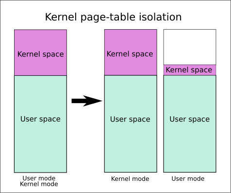

# xv6-riscv 中的 KPTI 机制

## KPTI 简述

KPTI (Kernel Page Table Isolation) 机制最初的主要目的是为了缓解 KASLR 的绕过以及 CPU 侧信道攻击。

在 KPTI 机制中，内核态空间的内存和用户态空间的内存的隔离进一步得到了增强。

- 内核态中的页表包括用户空间内存的页表和内核空间内存的页表。
- 用户态的页表只包括用户空间内存的页表以及必要的内核空间内存的页表，如用于处理系统调用、中断等信息的内存。



简而言之，KPTI 机制通过在系统调用等由用户态陷入内核态的过程中切换页表，使得内核态不能直接访问用户态的虚拟内存和执行用户态的代码段来避免熔断安全漏洞。

## xv6-riscv 中的 KPTI

### 上下文切换

关于用户态陷入内核态的上下文切换，定义在 `kernel/trampoline.S` 中的 `uservec` 中：

```assembly
uservec:    
	#
        # trap.c sets stvec to point here, so
        # traps from user space start here,
        # in supervisor mode, but with a
        # user page table.
        #
        # sscratch points to where the process's p->trapframe is
        # mapped into user space, at TRAPFRAME.
        #
        
	# swap a0 and sscratch
        # so that a0 is TRAPFRAME
        csrrw a0, sscratch, a0

        # save the user registers in TRAPFRAME
        sd ra, 40(a0)
        sd sp, 48(a0)
        sd gp, 56(a0)
        sd tp, 64(a0)
        sd t0, 72(a0)
        sd t1, 80(a0)
        sd t2, 88(a0)
        sd s0, 96(a0)
        sd s1, 104(a0)
        sd a1, 120(a0)
        sd a2, 128(a0)
        sd a3, 136(a0)
        sd a4, 144(a0)
        sd a5, 152(a0)
        sd a6, 160(a0)
        sd a7, 168(a0)
        sd s2, 176(a0)
        sd s3, 184(a0)
        sd s4, 192(a0)
        sd s5, 200(a0)
        sd s6, 208(a0)
        sd s7, 216(a0)
        sd s8, 224(a0)
        sd s9, 232(a0)
        sd s10, 240(a0)
        sd s11, 248(a0)
        sd t3, 256(a0)
        sd t4, 264(a0)
        sd t5, 272(a0)
        sd t6, 280(a0)

	# save the user a0 in p->trapframe->a0
        csrr t0, sscratch
        sd t0, 112(a0)

        # restore kernel stack pointer from p->trapframe->kernel_sp
        ld sp, 8(a0)

        # make tp hold the current hartid, from p->trapframe->kernel_hartid
        ld tp, 32(a0)

        # load the address of usertrap(), p->trapframe->kernel_trap
        ld t0, 16(a0)

        # restore kernel page table from p->trapframe->kernel_satp
        ld t1, 0(a0)
        csrw satp, t1
        sfence.vma zero, zero

        # a0 is no longer valid, since the kernel page
        # table does not specially map p->tf.

        # jump to usertrap(), which does not return
        jr t0
```

可以看到 `csrw satp, t1` 这条语句将用户态的页表切换成了内核态的页表，也就是说，在内核态中尽管可以访问用户态页表，但无法直接通过虚拟内存访问用户态代码段，因为我们没有在内核页表中为用户代码段直接做映射。

### 内核访问用户态数据

关于内核如何访问用户态数据定义在 `kernel/vm.c` 的 `copyout` 和 `copyin` 函数中：

```c
// Copy from kernel to user.
// Copy len bytes from src to virtual address dstva in a given page table.
// Return 0 on success, -1 on error.
int
copyout(pagetable_t pagetable, uint64 dstva, char *src, uint64 len)
{
  uint64 n, va0, pa0;

  while(len > 0){
    va0 = PGROUNDDOWN(dstva);
    pa0 = walkaddr(pagetable, va0);
    if(pa0 == 0)
      return -1;
    n = PGSIZE - (dstva - va0);
    if(n > len)
      n = len;
    memmove((void *)(pa0 + (dstva - va0)), src, n);

    len -= n;
    src += n;
    dstva = va0 + PGSIZE;
  }
  return 0;
}

// Copy from user to kernel.
// Copy len bytes to dst from virtual address srcva in a given page table.
// Return 0 on success, -1 on error.
int
copyin(pagetable_t pagetable, char *dst, uint64 srcva, uint64 len)
{
  uint64 n, va0, pa0;

  while(len > 0){
    va0 = PGROUNDDOWN(srcva);
    pa0 = walkaddr(pagetable, va0);
    if(pa0 == 0)
      return -1;
    n = PGSIZE - (srcva - va0);
    if(n > len)
      n = len;
    memmove(dst, (void *)(pa0 + (srcva - va0)), n);

    len -= n;
    dst += n;
    srcva = va0 + PGSIZE;
  }
  return 0;
}
```

可以看到，为了访问用户态数据，我们需要首先将用户态的虚拟地址经过用户态页表进行地址翻译转成物理地址，之后再通过物理地址直接访问用户态数据即可，那么由于在内核中的数据段是进行 1 : 1 映射的，因此内存访问在经过 MMU 地址翻译的时候不会出错，关于内核地址映射定义在 `kernel/vm.c` 的 `kvmmake` 函数中：

```c 
// Make a direct-map page table for the kernel.
pagetable_t
kvmmake(void)
{
  pagetable_t kpgtbl;

  kpgtbl = (pagetable_t) kalloc();
  memset(kpgtbl, 0, PGSIZE);

  // uart registers
  kvmmap(kpgtbl, UART0, UART0, PGSIZE, PTE_R | PTE_W);

  // virtio mmio disk interface
  kvmmap(kpgtbl, VIRTIO0, VIRTIO0, PGSIZE, PTE_R | PTE_W);

  // PLIC
  kvmmap(kpgtbl, PLIC, PLIC, 0x400000, PTE_R | PTE_W);

  // map kernel text executable and read-only.
  kvmmap(kpgtbl, KERNBASE, KERNBASE, (uint64)etext-KERNBASE, PTE_R | PTE_X);

  // map kernel data and the physical RAM we'll make use of.
  kvmmap(kpgtbl, (uint64)etext, (uint64)etext, PHYSTOP-(uint64)etext, PTE_R | PTE_W);

  // map the trampoline for trap entry/exit to
  // the highest virtual address in the kernel.
  kvmmap(kpgtbl, TRAMPOLINE, (uint64)trampoline, PGSIZE, PTE_R | PTE_X);

  // map kernel stacks
  proc_mapstacks(kpgtbl);
  
  return kpgtbl;
}
```

## 引用

- [KPTI WiKi](https://en.wikipedia.org/wiki/Kernel_page-table_isolation)
- [KPTI CTF-WiKi](https://ctf-wiki.org/pwn/linux/kernel-mode/defense/isolation/user-kernel/kpti/)

