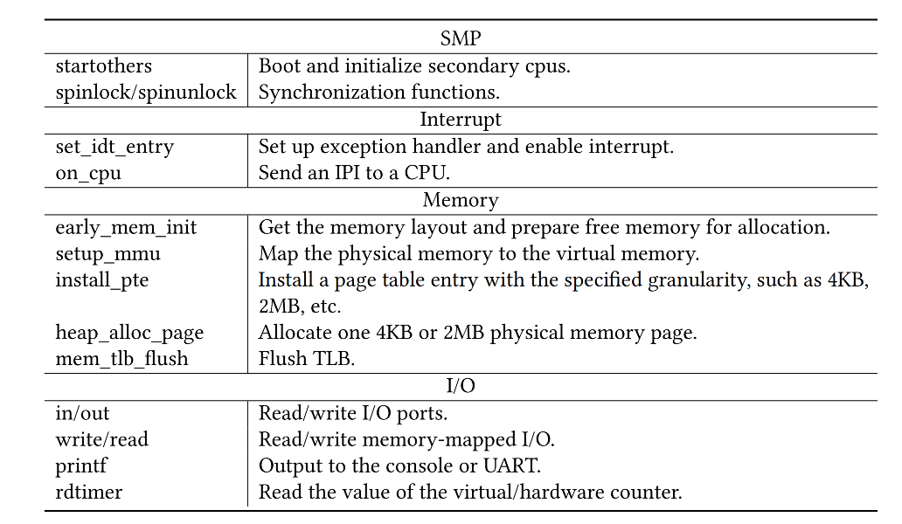
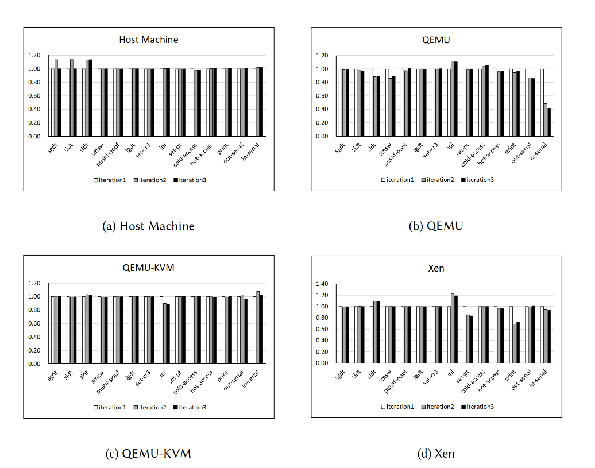

# HyperBench: A Benchmark Suite for Virtualization Capabilities

## COST MODEL

- $GNR(Guest Native Ratio) = \frac{T_{guest}}{T_{native}}$

- $T_{guest} = T_{direct} + T_{virt}$

- $T_{virt} = T_{cpu} + T_{memory} + T_{io} + \eta$

- $T_{cpu} = C_{sen} * T_{sen} + C_{ext} * T_{ext}$

- $T_{memory} = C_{switch} * T_{switch} + C_{sync} * T_{sync} + C_{cons} * T_{cons} + C_{two} * T_{two}$

- $T_{io} = C_{in} * T_{in} + C_{out} * T_{out}$

## HYPERBENCH BENCHMARKS

### 敏感指令

- 非特权指令：在硬件辅助虚拟化中，VM 执行这些指令和 OS 相同，对于二进制翻译来说会触发翻译流程。

- 特权指令：除了硬件辅助虚拟化技术允许特权级指令直接运行在物理 CPU 上；对于 trap & emulate 策略，特权指令会触发 trap；对于动态二进制翻译，特权指令将会被翻译成一系列 Shadow Structures 相关的正常指令。

### 异常

异常 benchmarks 需要触发特定的虚拟化异常指令，包括：Hypercall、虚拟核间中断（IPI）。

### 内存

内存 benchmarks 主要需要触发从 GVA 到 HPA 的翻译进程和相关的操作，例如 hypervisor-level 的页表的创建，同步 guest 页表和 hypervisor-level 页表。做不同模式的内存访问最直接的方式是触发这些事件。

- Hot Memory Access: 由于程序的时间局部性和空间局部性使得 hot memory access 在真实世界中具有普遍性。虚拟 TLB 应该确保 hot memory access 有一个尽可能高的命中率。TLB 命中率越高，硬件 TLB 和虚拟 TLB 之间的差别越小。在此基准测试中，工作集大小以及页面映射大小是可以调节的。如果工作集很大的话将会 overwhelm TLB 并且会触发更多的页表遍历。使用大页可以减少 TLB miss 次数。guest 和 host 必须同时使用 2MiB 的大页以保证处理器在虚拟化环境中使用 2MiB 的 TLB。可以通过调整 guest  页表大小和 hypervisor 页表大小来验证这个影响。
- Cold Memory Access: Cold Memory Access 意图去触发 TLB misses 并且触发 hypervisor page fault。QEMU 中的 cold memory access 只会造成二维页表遍历，因为 QEMU 中的内存在开始阶段就已经被分配了。由于一些 hypervisor-level 的页表在开始是空的（例如 SPT 和 EPT），因此 cold memory access 要求 hypervisor 重新创建页表。这个 benchmark 可以用来计算 $T_{memory}$ 的时间。
- Set Page Table: 这个 benchmark 会设置大量页表，既包含 hot memory access 也包含 cold memory access。这个 benchmark 模拟了大量内存分配的操作。


### I/O

IO benchmarks 主要用来测试 host 和 guest  的通信机制。hypervisor 可以通过模拟、半虚拟化、分配和 IO 设备共享等方式来支持 IO 请求。这些模型中的一个标准测试接口是应用程序和操作系统之间的接口。然后，应用程序的层级很高，应用程序的复杂测试用例可能会掩盖性能差距。任何模型都会通过 PIO 或者 MMIO 来访问真实物理设备。

- IN: 轮询和中断是 host 向 guest 通知的两个主要方式。benchmark 不断重复读取 serial port 寄存器用来模拟轮询 IO。对于 QEMU 来说，IO 指令被自己模拟。对于 QEMU/KVM 来说，在 QEMU 模拟 IO 指令之前，VM 会 trap 到 host kernel 然后交由 QEMU 来控制。对于 Xen 来说，IN benchmark 触发以下行为
  
  - VM trap 到 Xen
  
  - Xen 向 Dom0 发送 IPI
  
  - 将控制权交给 QEMU 并且模拟 IO 指令
  
  - 返回 VM

- OUT：作为 IN, OUT benchmark 的一部分，OUT benchmark 向串口寄存器不断输出字符。这个 benchmark 关注于从 guest 到 host 的通知机制的延迟。

- Print：这个 benchmark 关注于字符串，将一串字符从内存中输出到对应的 serial IO 中。


## IMPLEMENTATION


### Architecture

在 native 环境中，HyperBench 直接运行在硬件上。benchmark 的行为在 HyperBench kernel 中进行测量，成为内部测量。在虚拟化环境中，HyperBench kernel 运行作为 test VM。在独立的裸机 hypervisor 中（例如 Xen），计时程序运行在特权级 VM 中；在 host hypervisor 中，计时程序作为常规的应用程序运行在 host OS 中。benchmark 既可以实现为内部测量也可以实现为计时程序，后者被称为外部测量。对于外部测量来说，HyperBench 在 benchmark 前后向 UART 发送计时信号，UART 重定向到外部计时程序通过 pipe。对于 QEMU 来说，时钟信号输出到模拟的 serial port 并被重定向到 console(如果使用了 `-nographic` 选项)。一旦读取到时钟信号，计时应用程序将读取当前 counter 的值。对于虚拟化环境来说，常规用户经常使用内部测量，因为它们没有使用时钟应用程序的权限。




- 可移植性：尽管不同的 bechmarks 关注于不同的特性，所有的 benchmarks 共享底层的 **POSIH**。POSIH 和硬件直接交互。因此 HyperBench 能够运行在任何体系结构上只要对应在对应体系结构的硬件驱动已经被实现了。

- 可扩展性：HyperBench 的一个重要优势是添加一个新的 benchmarks 是相当容易的。那是由于 POSIH 在内存布局上进行了仔细地设计。当添加一个新的 benchmark 时许多函数可以被重用。**.benchmarks** 段是一个描述所有的 HyperBench benchmarks 所映射的所有数据结构的一个描述符表：

```c
typedef void (*function_t)();
typedef struct {
const char∗ name;
const char∗ category;
function_t init;
function_t benchmark;
function_t benchmark_control;
function_t cleanup;
uint64_t iteration_count;
}benchmark_ t;
```

### Measurement

有两种测量 benchmark 的方式，分别为内部测量和外部测量。但是无论哪一种都不完美。HyperBench 中的定时器可能不准确或者未完全校准；尽管 host 中的计时器更为准确，但从 HyperBench 到通知计时应用程序也有一定程度的变化。HyperBench 内核发送计时信号到计时应用程序完成读取硬件计数器之间的时间的稳定性决定了测量结果的准确性。 为了解决这个问题，HyperBench 设计了一个空闲基准测试，它执行两次连续的计数器读取。根据 Idle 的结果，相同或者更高次数的迭代可以抵消波动。

在测量多核系统性能的情况下，由中断和调度引起的变化会使测量结果偏移数千个周期。进一步提高外部测量、乱序执行和多核调度干扰的准确性被考虑在内。HyperBench 通过 grub 和将 VCPU 到 PCPU 进行映射来隔离 CPU。在获取时间前后使用指令屏障避免乱序执行或流水线扭曲测量结果。

## EVALUATION




上表展示了运行 benchmarks 的结果，单位是时钟/每次迭代。

根据上表的推论，可以推断出 hypervisior 优化的一个措施是减少虚拟化敏感事件。将硬件虚拟化和软件虚拟化技术合并会破坏 VMM 中退出和其发生次数之间的一一映射关系。另一个例子是半虚拟化 IPI，它使用 Hypercall 向多个 VCPUs 发送 IPI。一批 IPI 仅需要一个VM退出。因此，cost model 中表示 C 和 T 之间关系的未确定运算符是虚拟化程序的重要特征。为了验证测试的虚拟化程序是否具有类似的特征，我们在主机机器和测试的虚拟化程序上使用可变迭代运行 HyperBench。

### Effectiveness

- Idle Benchmark: physical machine 比虚拟化环境表现更好因为 host 直接读取硬件 `counter`。

- Hypercall Benchmark: KVM 和 Xen 在性能上没有表现出显著的差异因为 KVM 和 Xen 都使用相同的硬件机制在 VM 和 hypervisor 之间进行转换。由于接收 VPCU 处于暂停状态，KVM 上的 IPI 成本超过一个硬件 IPI 和一个 Hypercall。KVM 上 IPI 和 Hypercall 的结果证实了这一点。我们还向 KVM 上正在运行的 CPU 发送了一个 IPI。该 IPI 消耗了3375 个时钟周期，这需要一个 Hypercall 和一个硬件 IPI。这表明 KVM x86 启用了“posted-interrupt processing” 功能。然而，Xen 的 IPI 比 KVM 花费更多的周期。在相同的硬件支持下，这是由于虚拟机监控器设置的差异。通过运行 **xl demsg** 命令，我们发现 Xen 未能启用远程中断重映射，并且不会启用 x2APIC。对于 QEMU 而言，IPI是比KVM 和 Xen 更昂贵的操作，这表明 DBT 在处理 IPI 方面表现不佳。

- Memory Benchmark: HyperBench 在揭示平台的内存虚拟化能力方面也表现出色。当KVM和Xen都使用 EPT 时，它们在构建 EPT 条目和 2D 页表遍历方面会遭受一定程度的性能降低。冷内存访问的结果显示了大约 1.4 倍的减速。对于冷内存访问，KVM 和 Xen 的 $T_{memory}$ 处于300个时钟周期的水平。对于 QEMU 来说，虽然从 GPA 到 HPA 的转换都是通过相对较慢的软件 MMU 和硬件 MMU 进行的，但在内存访问过程中没有出现 VM exit。最终结果是 QEMU 比 KVM 和 Xen 稍微具有一些性能优势。热内存访问基准测试显示，x86 KVM 和 x86 Xen 在 TLB 虚拟化方面与主机具有相同的能力。借助EPT，直接从GVA到HPA的映射可以被缓存。在 QEMU 中，只有从主机虚拟地址（等效于GPA）到HPA的映射可以被缓存。对于QEMU的热内存访问，GVA 到 GPA 的转换会错过TLB，而 HVA 到 HPA 的转换可能会击中 TLB。因此，QEMU 上的热内存访问性能仍然很差，但需要的时钟周期比冷内存访问要少。对于大多数为热内存访问的 Set Page Table基准测试，QEMU 的代价比 KVM 和 Xen 高出一个数量级。

- IO Benchmark: I/O 基准测试反映了虚拟平台的 hypervisor 设计对虚拟化能力的影响。在 KVM 和 Xen 中，I/O 设备由 QEMU 在用户空间中模拟。虽然 QEMU 模拟的串行端口的表现优于物理端口，但是 KVM 和 Xen 上的 I/O 基准测试比主机机器上糟糕得多。VM 和 hypervisor 之间的信号机制抵消了 QEMU 的优势，导致了巨大的差异。在 KVM 中，当 HyperBench 内核发起 I/O 请求时，会有两个主要的上下文切换。首先是在同一物理核心上 HyperBench 内核和 KVM 之间的转换。其次，由于 KVM 在内核空间运行，通知在用户空间运行的 QEMU 需要另一个上下文切换。在 Xen 中，由于 HyperBench 内核和 Dom0 在不同的物理核心上运行，因此，Xen 必须从运行 HyperBench 内核的 CPU 向运行 Dom0 的 CPU 发送物理 IPI。告知 QEMU 模拟 I/O 请求的通知路径比 KVM 要长。因此，Xen 在 I/O 基准测试方面比 KVM 慢得多。

## References

- Wei S, Zhang K, Tu B. Hyperbench: A benchmark suite for virtualization capabilities[J]. Proceedings of the ACM on Measurement and Analysis of Computing Systems, 2019, 3(2): 1-22.
