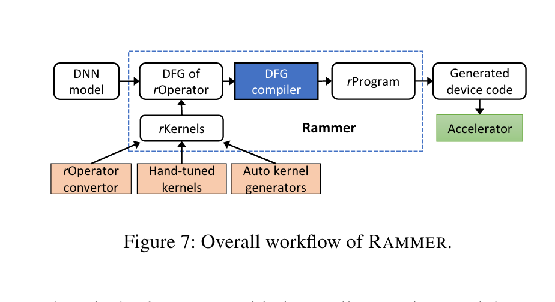
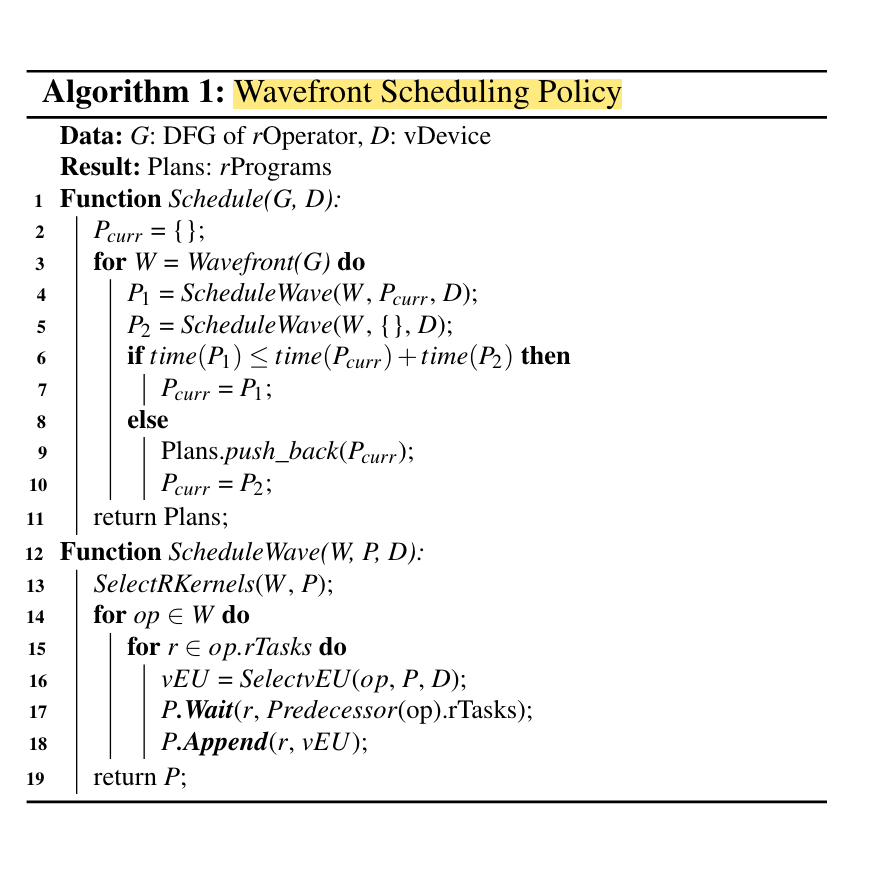

# nnfusion 源码阅读

首先进入 `tools/nnfusion/nnfusion.cpp` 进入 main 函数开始执行，以 tensorflow、CUDA_GPU 为例进行解析：

- `nnfusion::frontend::load_tensor_model()` 用来加载 tensorflow 模型并将其转化成图。

- 若编译器后端非空，则执行 `cuda_engine.run_on_graph(graph)`，其中 `cuda_engine` 为建立的的空的 `CudaEngine` Object。

## Frontend(数据流图生成)

以 tensorflow 为例，首先查看 `frontend/tensorflow_import/tensorflow.cpp`，在该文件中定义了 `load_tensorflow_model()` 函数并调用了 `GraphConvert` 将模型转换成数据流图：

```cpp
            GraphConvert::GraphConvert(const tensorflow::GraphDef& proto)
                : tf_graph_proto{&proto}
            {
                NNFUSION_LOG(INFO) << "Converting Tensorflow Graph";

                m_graph = std::make_shared<nnfusion::graph::Graph>();

                generate_topology();

                std::vector<InputInfo> inputs;
                while (!tf_topology_.empty())
                {
                    uint32_t node_idx = tf_topology_.front();
                    tf_topology_.pop();
                    inputs.clear();
                    const auto& node_proto = proto.node(node_idx);
                    bool in_control_dependence = false;
                    for (auto& input : node_proto.input())
                    {
                        TensorId input_tensor(ParseTensorName(input));
                        int src_index = input_tensor.second;

                        std::shared_ptr<nnfusion::graph::GNode> src_node;

                        auto iter = m_node_map.find(input_tensor.first);
                        NNFUSION_CHECK(iter != m_node_map.end())
                            << "Node " << node_proto.name()
                            << " has Un-Converted input node: " << input_tensor.first;
                        if (src_index == nnfusion::graph::Graph::kControlSlot)
                        {
                            in_control_dependence = true;
                            if (iter->second.size() > 0)
                            {
                                src_node = iter->second.at(0);
                                inputs.emplace_back(input_tensor.first, src_node, -1);
                            }
                        }
                        else
                        {
                            NNFUSION_CHECK(!in_control_dependence)
                                << "Control dependencies must come after regular "
                                   "dependencies.";
                            src_node = iter->second.at(src_index);
                            inputs.emplace_back(input_tensor.first, src_node, 0);
                        }
                    }

                    auto results = convert_node(node_proto);
                    m_node_map[node_proto.name()] = {};
                    for (auto& name_gnode_pair : results)
                    {
                        auto gnode = name_gnode_pair.second;
                        m_node_map[name_gnode_pair.first].push_back(gnode);

                        // add control edge
                        for (size_t input_idx = 0; input_idx < inputs.size(); input_idx++)
                        {
                            NNFUSION_CHECK_NOT_NULLPTR(inputs[input_idx].node)
                                << "Back edge is not supported now.";

                            if (inputs[input_idx].index == nnfusion::graph::Graph::kControlSlot)
                            {
                                m_graph->add_control_edge(inputs[input_idx].node, gnode);
                            }
                            else
                            {
                                // normal edge, do nothing
                            }
                        }
                        if (gnode->get_name() != name_gnode_pair.first)
                        {
                            //NNFUSION_CHECK(!(*gnode)["Alias"].is_valid())
                            //    << "node " << gnode->get_name() << " has more than one alias.\nThe tensorflow node is : \n" << node_proto.DebugString();
                            (*gnode)["Alias"] = name_gnode_pair.first;
                        }

                        if (tf_output_name_.find(node_proto.name()) != tf_output_name_.end())
                        {
                            m_graph_outputs.emplace_back(gnode);
                        }
                    }

                    for (size_t i = 0; i < tf_node_outputs_[node_idx].size(); ++i)
                    {
                        const int output = tf_node_outputs_[node_idx][i];
                        tf_pending_counts_[output]--;
                        if (tf_pending_counts_[output] == 0)
                        {
                            tf_topology_.push(output);
                        }
                    }
                }

                m_graph->set_outputs(m_graph_outputs);
                m_graph->set_default_parameters();
                NNFUSION_LOG(INFO) << "convert graph done";
            }
```

代码逻辑如下： 

- 创建`GraphConvert`类的构造函数，该类用于将TensorFlow的GraphDef（计算图的协议缓冲区表示）转换为nnfusion的图。

- 初始化一些成员变量，包括指向TensorFlow GraphDef的指针 `tf_graph_proto`，以及用于存储nnfusion图和其他信息的成员变量。

- 调用`generate_topology()`函数，生成TensorFlow图的拓扑排序。

- 进入主循环，从TensorFlow的拓扑排序队列 `tf_topology_` 中依次取出节点。

- 对于当前节点，解析其输入和依赖节点，并生成 `InputInfo` 的向量 `inputs`，每个`InputInfo` 包含输入张量的名字、源节点以及输入索引。

- 调用 `convert_node(node_proto)` 函数，将当前TensorFlow节点转换为nnfusion节点。该函数将会返回一个由新的nnfusion节点组成的映射表，其中键是新节点的名字，值是新节点的指针。

- 更新节点映射表 `m_node_map`，将新生成的nnfusion节点添加到映射表中，并将新节点与输入节点之间建立边关系。根据输入的索引，如果是控制依赖关系，则添加控制边，否则添加数据依赖边。

- 如果新节点的名字与TensorFlow节点的名字不同，将新节点的名字设置为节点的别名。这通常是因为TensorFlow节点的名字可能包含特殊字符，不适合作为nnfusion节点的名字。

- 如果当前TensorFlow节点是输出节点，将其对应的nnfusion节点添加到图的输出节点列表 `m_graph_outputs` 中。

- 对于当前节点的输出，更新其在待处理节点计数数组 `tf_pending_counts_` 中的计数，并根据计数是否为零，决定是否将其添加到下一轮的处理队列中。

- 循环直至处理完所有节点，最后设置nnfusion图的输出节点并设置默认参数，完成TensorFlow到nnfusion的图转换。

## Engine

观察 `CudaEngine` 发现其是 `Engine` 的子类，`Engine` 有以下几个私有变量：

- `InterpreterPassManager::Pointer m_passes`

- `GraphPassManager::Pointer g_passes`

- `GraphVisitor::Pointer g_visitor`

观察 `Engine::run_on_graph(graph::Graph::Pointer graph, EngineContext::Pointer context)` 的实现，发现分别执行以下三个函数：

- `g_passes->run_on_graph(graph, context)`

- `g_visitor->run_on_graph(graph, context)`

- `g_visitor->run_on_graph(graph, context)`



基于上图不难推断：

- `g_passes->run_on_graph(graph, context)` 用于将算子数据流图转成 rOperator 的数据流图

- `g_visitor->run_on_graph(graph, context)` 用于将 rOperator 的数据流图转成 rProgram

- `g_visitor->run_on_graph(graph, context)` 用于将 rProgram 转换成设备可运行的代码

### rOperation 生成

观察 `GraphPassManager::Pointer` 是一个继承自`vector<shared_ptr<nnfusion::pass::graph::GraphPassBase>>` 的类，有一个 `run_on_graph` 的方法。

观察 `GraphPassBase` 发现其是一个基类，里面没有任何私有数据。考虑到 `CudaEngine` 在初始化时向 `g_passes` push 了很多派生类：

```cpp
CudaEngine::CudaEngine()
    : Engine()
{
    g_passes->push_back(make_shared<CSEPass>());
    g_passes->push_back(make_shared<AutodiffPass>());
    g_passes->push_back(make_shared<GradientWeightMappingPass>());
    g_passes->push_back(make_shared<RuntimeConstantFoldingPass>());
    g_passes->push_back(make_shared<MultiReshapeFoldingPass>());
    g_passes->push_back(make_shared<VectorDotTransposePass>());
    g_passes->push_back(make_shared<GemmFusionPass>());
    g_passes->push_back(make_shared<BatchNormInferenceFoldingPass>());
    g_passes->push_back(make_shared<AssignLayoutPass>());
    g_passes->push_back(make_shared<OpInplacePass>());

    g_passes->push_back(make_shared<PatternSubstitutionPass>());

    // Kernel selection
    g_passes->push_back(make_shared<DefaultGNodeDeviceDispatcher>());
    g_passes->push_back(make_shared<ProfilingBasedKernelSelector>());
    g_passes->push_back(make_shared<FetchBasedSelector>());
    g_passes->push_back(make_shared<DefaultKernelSelector>());

    // GPU specific graph passes
    g_passes->push_back(make_shared<KernelFusionPass>());
    g_passes->push_back(make_shared<KernelProfilingPass>());
    g_passes->push_back(make_shared<PatternSubstitutionPass>());
    g_passes->push_back(make_shared<BlockFusionPass>());

    // Specific opt for dot
    g_passes->push_back(make_shared<DotTransposePass>());

    // Assign stream passes
    g_passes->push_back(make_shared<AssignAsyncInfoPass>());

    // Visitor
    g_visitor = make_shared<ReversedDFSVisitor>();

    // extract graph signature
    m_passes->push_back(make_shared<ExtractGraphSignature>());
    // Do tensor allocation plan
    m_passes->push_back(make_shared<TensorDeviceDispatcher>());
    m_passes->push_back(make_shared<TensorLivenessAnalysis>());
    m_passes->push_back(make_shared<InplaceTensorAnalysis>());
    m_passes->push_back(make_shared<AssignTensorMemoryLayout>(64, false));

    // Do codegen
    m_passes->push_back(make_shared<CudaCodegenPass>());
}
```

在这个阶段主要完成从 DFG of Operator 到 DFG of rOperator 的转换，这里不改变 graph 的数据类型，主要主要通过替换 graph 中的 node 完成。

点入 `CSEPass` 查看，发现其中实现了 `run_on_graph()`:

```cpp
bool CSEPass::run_on_graph(std::shared_ptr<Graph>& graph)
{
    bool enable_cse = FLAGS_fcse;
    if (!enable_cse)
        return true;

    bool replaced = false;
    unordered_map<NodeKey, shared_ptr<GNode>> expressions{};

    for (auto n : graph->get_ordered_ops())
    {
        auto op = n->get_op_ptr();
        if (op->is_output() || op->is_parameter())
        {
            continue;
        }

        NodeKey n_key(n);
        if (expressions.count(n_key))
        {
            graph->replace_node(n, expressions.at(n_key), false);
            replaced = true;
        }
        else
        {
            expressions.insert(make_pair(n_key, n));
        }
    }
    return true;
}
```

这是一个公共子表达式消除(Common Subexpression Elimination，CSE)的优化过程，如代码所示:

- 读取优化开关：首先，代码会读取全局标志 `FLAGS_fcse`，以确定是否启用公共子表达式消除优化。如果未启用，则函数直接返回 `true`，不进行任何优化。

- 初始化变量：创建一个用于存储表达式的 `unordered_map`，命名为 `expressions`。该映射用于存储已经遍历的节点以及其对应的公共子表达式。

- 遍历计算图节点：代码使用 `graph->get_ordered_ops()` 遍历计算图中的每个节点（操作）。对于每个节点，执行以下操作：
  
  a. 检查节点类型：首先，代码检查当前节点是否是输出节点或参数节点。如果是，表示这些节点不是计算过程的一部分，因此跳过处理。
  
  b. 创建节点键：通过 `NodeKey` 类创建一个节点键 `n_key`，用于标识当前节点的子表达式。
  
  c. 查找子表达式：检查 `expressions` 映射中是否已经存在与 `n_key` 对应的节点。如果已经存在，说明这个子表达式已经出现过，可以被替换。
  
  d. 替换或存储子表达式：如果在 `expressions` 中找到了相同的子表达式，那么当前节点可以被替换为之前存储的节点。使用 `graph->replace_node` 方法实现替换操作。如果没有找到相同的子表达式，就将当前节点插入到 `expressions` 中。

- 返回结果：遍历结束后，函数返回 `true`，表示优化完成。

`ProfilingBasedKernelSelector` 是一个基于分析器用来选择内核算子的算法实现：

```cpp
bool ProfilingBasedKernelSelector::run_on_graph(std::shared_ptr<nnfusion::graph::Graph>& graph)
{
    bool enable_tuning = FLAGS_fkernel_tunning;
    if (!enable_tuning)
        return true;

    // auto dev_name = FLAGS_fdefault_device.c_str();
    // NNFusion_DeviceType default_device = nnfusion::get_device_type(dev_name);

    // Config area
    vector<string> white_list{"Broadcast"};
    //bool all_device = false;
    NNFusion_DeviceType the_device = ROCM_GPU;

    // if (the_device != default_device)
    //     return true;

    // Currently *ONLY* has BroadCast Selection
    std::vector<std::shared_ptr<GNode>> nodes = graph->get_nodes();
    for (auto it : nodes)
    {
        if (!(*it)["DeviceType"].is_valid())
        {
            NNFUSION_CHECK_FAIL() << "GNode DeviceType should be assigned before this pass："
                                  << it->get_name();
        }
        auto n_device_type = (*it)["DeviceType"].as<NNFusion_DeviceType>();
        NNFUSION_CHECK(n_device_type != UNKNOWN);
        if (n_device_type != the_device)
            continue;
        auto opname = it->get_op_type();
        for (auto& rule : white_list)
            if (opname == rule)
            {
                (*it)["Enable_Kernel_Selection"] = true;
                // if (!all_device)
                //     (*it)["Kernel_Selection_Device"] = the_device;
            }
    }

    for (auto it : nodes)
    {
        if ((*it)["Enable_Kernel_Selection"].is_valid() &&
            (*it)["Enable_Kernel_Selection"].as<bool>())
        {
            auto n_device_type = (*it)["DeviceType"].as<NNFusion_DeviceType>();
            auto ans = profiling_best(it, n_device_type, get_default_runtime(n_device_type));
            if (ans.second != nullptr)
                (*it)["Kernel_Selection_Result"] = ans;
            else
            {
                if (n_device_type == ROCM_GPU)
                {
                    auto ans_cuda = profiling_best(it, CUDA_GPU, get_default_runtime(CUDA_GPU));
                    if (ans_cuda.second != nullptr)
                        (*it)["Kernel_Selection_Result"] = ans_cuda;
                }
            }
        }
    }

    return true;
}
```

算法的流程如下：

- 读取优化开关：首先，代码会读取全局标志 `FLAGS_fkernel_tunning`，以确定是否启用基于性能分析的内核选择优化。如果未启用，函数直接返回 `true`，不进行任何优化。

- 配置区域：代码定义了一个白名单 `white_list`，其中列出了需要进行内核选择的操作名称（Op name）。在此示例中，只有操作名为 "Broadcast" 的节点会进行内核选择。

- 获取计算图中的节点：使用 `graph->get_nodes()` 获取计算图中的所有节点，并将它们存储在 `nodes` 向量中。
  
  - 遍历节点进行内核选择：对于每个节点，执行以下操作：
    
    检查节点的设备类型：检查当前节点的 `DeviceType` 是否已被赋值。如果没有，表示在执行此优化之前应该为节点分配设备类型，否则会产生错误。如果设备类型有效，则继续下一步。
  
  - 检查设备类型匹配：检查节点的设备类型是否与预设的 `the_device`（在代码中为 ROCM_GPU）匹配。如果不匹配，表示该节点不在当前设备上进行内核选择，因此跳过此节点。
  
  - 匹配白名单：检查当前节点的操作类型（Op type）是否在白名单 `white_list` 中。如果操作名在白名单中，表示该节点需要进行内核选择。将节点的 `Enable_Kernel_Selection` 属性设置为 `true`，以标记需要进行内核选择的节点。

- 遍历进行实际的内核选择：再次遍历所有节点，对于标记为需要内核选择的节点，执行以下操作：
  
  - 获取设备类型和运行时：获取节点的设备类型和默认的运行时（Runtime）实现。
  
  - 进行性能分析：使用 `profiling_best` 函数对当前节点进行性能分析，以找到最佳的内核实现。
  
  - 更新节点属性：如果找到了最佳内核实现，将其存储在节点的 `Kernel_Selection_Result` 属性中。

- 返回结果：遍历结束后，函数返回 `true`，表示优化完成。

#### Profiler

TODO

### rProgram 生成

在 `cuda.cpp` 中初始化 `CudaEngine` 的时候将 `g_vistor` 初始化了为 `ReversedDFSVistor`，在 `ReversedDFSVistor` 中实现了 `run_on_graph` 的方法：

```cpp
nnfusion::ir::Program::Pointer ReversedDFSVisitor::run_on_graph(shared_ptr<graph::Graph> graph,
                                                                EngineContext::Pointer context)
{
    NNFUSION_LOG(INFO) << "Translating graph:\t" << graph->get_name();

    auto program =
        make_shared<ir::Program>(nnfusion::ir::Program::create_single_basic_block_program());
    auto bb_main = program->get_entry();

    // Translate the Node
    // Currently:
    // * Translate each gnode into an instruction;
    // * Store all instruction inside one basicblock since we don't have
    //   control-flow by now.
    nnfusion::graph::GNodeVector node_vec;
    if (FLAGS_fstream_assign_policy == "kernel_prof_based")
        node_vec = graph->get_bfs_ordered_ops();
    else
        node_vec = graph->get_ordered_ops();

    for (auto gnode : node_vec)
    {
        shared_ptr<TranslationUnit> _tu(new TranslationUnit());
        nnfusion::ir::Instruction::Pointer ir(new nnfusion::ir::Instruction);
        ir->setGNode(gnode);
        ir->copy_tags_from(*gnode);
        ir->setName(gnode->get_name());
        bb_main->push_back(ir);
        add_memcpy_ir(graph, gnode, bb_main);
    }

    return program;
}
```

首先创建一个空的 program，并将图中的算子转换成算子节点的集合（在论文中称为 rTask)，随后遍历节点集合。

这里的 Program 是一个 `BasicBlock` 的向量集合，而 `BasicBlock` 又是 `Instruction` 的向量集合，而 `Instruction` 是一个简单包裹的类型，有 `gnode`、`kernel`、`inputs`，`outputs`，`internal_tensors` 等属性，其中 `kernel` 是一个 `KernelEmitter` 类型，可以对一个操作符生成特殊的计算 kernel，也就是论文中提到的 rKernels。因此 `Instruction` 可以看成是一个 `rTask` 也就是可以执行的最小单元。



在遍历节点集合过程中的重点是 `add_memcpy_ir(graph, gnode, bb_main)` 的调用：

- 首先根据不同的类型创建不同的 `AsyncManagerFactor`

- 随后遍历该节点的所有出边，若出边不是自己的话，也即是从该节点到下一个节点有数据流通过，创建一个 `memcpy_ir`，也即在中间插入一个内存拷贝的指令。随后将 memcpy_ir 的输入 tensor 修改为出边节点的输入 tensor， 将输出 tensor 设置为新建的 tensor。

- 随后检查 `memcpy_ir` 和输出节点的 `execution_thread` 是否为一个，若不相同的话则添加等待队列和屏障。

- 最终将 `memory_ir` 加到 bb_main 这个 BasicBlock 中（这里有个问题，为何只创建了单个 BasicBlock，按照论文描述，应该是 rProgram 直接包含 rTask，代码里是：Program(BasicBlock(Instruction)）

#### AsyncManagerFactor

TODO

### 代码生成

生成 program 后，调用 `m_passes->run_on_program(p, context)` 用来进行代码生成，检查 `run_on_program()` 函数：

- 首先初始化 `_tu`(翻译单元，暂时不知道做什么的)和 `ctx`

- 遍历所有 pass 进行运行

检查 `nnfusion/engine/device/cuda.cpp`，发现 `CudaEngine` 在初始化时添加了如下的 pass:

```cpp
    // extract graph signature
    m_passes->push_back(make_shared<ExtractGraphSignature>());
    // Do tensor allocation plan
    m_passes->push_back(make_shared<TensorDeviceDispatcher>());
    m_passes->push_back(make_shared<TensorLivenessAnalysis>());
    m_passes->push_back(make_shared<InplaceTensorAnalysis>());
    m_passes->push_back(make_shared<AssignTensorMemoryLayout>(64, false));

    // Do codegen
    m_passes->push_back(make_shared<CudaCodegenPass>());
```

因此，代码生成部分会依次遍历以上所有 pass 并执行 `run()` 方法。
