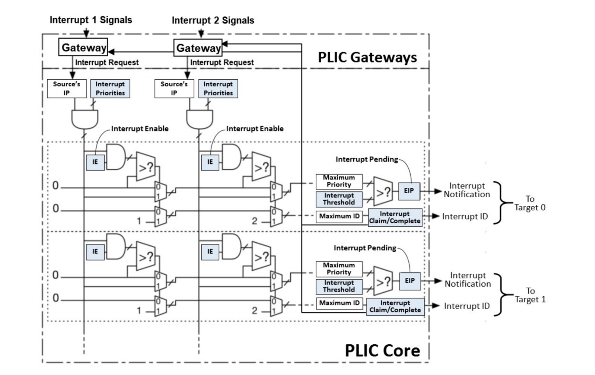

# RISC -V Interrupt

## CLINT

**Core Local Interrupter(CLINT)** 提供一个固定优先级的设计，仅对于来自更高特权级的中断提供抢占支持。`CLINT` 最初的设计是用来服务于 CPU 的软件和时钟中断，因为它不控制直接连接到 CPU 的其他本地中断。

有两种不同的 `CLINT` 模式的操作，`direct` 模式和 `vectored` 模式。为了配置 `CLINT` 模式，需要写 `mtvec.mode`；直接模式是 0 而向量模式是 1。直接模式是默认的 reset 值。`mtvec.base` 是这两种模式的触发中断和异常的基地址。

`mtvec.base` 的对齐要求如下所示：

- 对于直接模式要 4 字节对齐

- 对于向量模式要 4*XLEN 字节对齐

- 对于 `CLIC` 模式要 64 字节对齐

### CLINT 直接模式

直接模式意味着所有中断和异常都 trap 到同一个处理函数，没有实现向量表。软件负责执行代码并找出发生的是什么中断或异常。

### CLINT 向量模式

向量模式引入了一种创建向量表的方法，硬件使用该向量表降低终端处理延迟。当中断发生时，`pc` 寄存器将被硬件转移到向量中断表中断 ID 中的地址。 中断处理函数的偏移量使用 `mtvec.base + (mcause.code * 4)` 来计算。

## CLIC

**Core Local Interrupt Controller(CLIC)** 是一个功能齐全的本地中断控制器，并且支持可编程中断级和优先级配置。`CLIC` 还支持给定特权级别内的嵌套中断（抢占），基于中断级别和优先级配置。

`CLINT` 和 `CLIC` 都集成了寄存器 `mtime` 和 `mtimecmp` 来配置定时器中断，和 `msip` 触发软件中断。除此之外，`CLINT` 和 `CLIC` 都运行在 core 时钟频率上。

## Common Registers to CLIC and CLINT

- msip: M mode software interrupt pending register, 用于断言当前 CPU 的软件中断。

- mtime: 运行在特定频率上的 M mode 时钟寄存器。 `CLINT` 和 `CLIC` 设计中的一部分。在包含一个或多个 CPU 的设计中只有一个 `mtime` 寄存器。

- mtimecmp: 内存映射的 M mode timer compare register，当 `mtimecmp` 的值比 `mtime` 的值更大或者相等时来处罚一个时钟中断，每个 CPU 都有一个 `mtimecmp` 寄存器。

## PLIC(Platform Level Interrupt Controller)

PLIC 被用于管理所有全局中断并且将它们路由到一个或者多个 CPU core。对于 PLIC 来说它可能转发单个中断源到多个 CPU。在进入 PLIC 处理函数后，CPU 将会读 claim 寄存器获取中断 ID。一次成功的 claim 将会自动清除在 PLIC 中断 pending 寄存器中的 pending 位，向系统表示这个中断已经被服务。如果必要的话，在 PLIC 中断处理进程中在中断源中的 pending flag 应该也被清理。对于 CPU 来说尝试去 claim 一个中断甚至当 pending bit 没有被设置的时候也是合法的。这可能发生，举个例子来说，当一个全局的中断被路由到多个 CPU，并且一个 CPU 已经在另一个 CPU 尝试 claim 之前 claim 了这个中断。在使用 `mret/sret/uret` 指令退出 PLIC 处理函数之前，claim/complete 寄存器被写回处理程序入口获得的非零 claim/complete 值。

### Interrupt Flow

- 全局中断从源送到中断网关

- 中断网关然后向 PLIC core 发送单个中断请求，PLIC 将这些锁存在 peding bits(IP) 中。

- 如果这些目标开启了中断并且该中断优先级超过了 threshold（阈值），PLIC core 将会把中断标志转发给一个或者多个目标。

- 当目标接受外部中断的时候，他会送一个中断声明(**claim**)请求去取得 PLIC core 为该目标锁存的最高优先级的全局中断标识符。

- PLIC core 清除相应的中断源等待位。

- 在目标处理完中断后，它向合适的中断网关发送中断完成消息。

- 中断网关现在可以转发相同源的中断请求向 PLIC core。


### RISC -V PLIC Operation Parameters

- Interrupt Priorities registers

- Interrupt Pending Bits registers

- Interrupt Enables registers

- Interrupt Thresholds registers

- Interrupt Claim registers

- Interrupt Completion registers



### Interrupt Priorities

中断优先级是无符号整数，支持的最大优先级与平台相关。中断优先级为 0 意味着从不中断。数值越大中断优先级越高。每一个全局中断源在MMIO 寄存器中有相关联的中断优先级寄存器。不同的中断源不需要支持同一组优先级数值。一个有效的实现可以硬连接所有输入优先级。 中断源优先级寄存器应该是 WARL 字段，以允许软件确定每个优先级规范（如果有）中读写位的数量和位置。

中断优先级是和 `priority` 优先级相关联的，中断优先级为 0 意味着从不中断，数值越高中断优先级越高；相同中断优先级情况下，最低的 Interrupt ID 有最高的优先级。

**PLIC Interrupt Priority Memory Map:**

```
0x000000: Reserved (interrupt source 0 does not exist)
0x000004: Interrupt source 1 priority
0x000008: Interrupt source 2 priority
...
0x000FFC: Interrupt source 1023 priority
```

### Interrupt Pending Bits

当前中断源在 PLIC core 中的 pending bits 可以从 pending 数组中读取，它的组织方式是使用 32 位寄存器。中断 ID 为 N 的 peding bit是存储在 (N/32) 字的 (N mod 32) bit 上。字 0 的 bit 0，代表不存在中断源为0，会被硬布线为0。

**PLIC Interrupt Pending Bits Memory Map:**

```
0x001000: Interrupt Source #0 to #31 Pending Bits
...
0x00107C: Interrupt Source #992 to #1023 Pending Bits
```

### Interrupt Enables

每个全局中断可以通过 `enables` 寄存器中合适的 bit 来进行开启。`enable` 寄存器是是 32 bit 的内存连续的数组，组织方式和 `pending` 相同。`enable` 寄存器的 0 word 0 bit 被硬编码为0，表示不存在。PLIC 有 15872 个中断使能控制块。

**PLIC Interrupt Enable Bits Memory Map:**

```
0x002000: Interrupt Source #0 to #31 Enable Bits on context 0
...
0x00207C: Interrupt Source #992 to #1023 Enable Bits on context 0
0x002080: Interrupt Source #0 to #31 Enable Bits on context 1
...
0x0020FC: Interrupt Source #992 to #1023 Enable Bits on context 1
0x002100: Interrupt Source #0 to #31 Enable Bits on context 2
...
0x00217C: Interrupt Source #992 to #1023 Enable Bits on context 2
0x002180: Interrupt Source #0 to #31 Enable Bits on context 3
...
0x0021FC: Interrupt Source #992 to #1023 Enable Bits on context 3
...
...
...
0x1F1F80: Interrupt Source #0 to #31 on context 15871
...
0x1F1FFC: Interrupt Source #992 to #1023 on context 15871
```

### Priority Threholds

PLIC 提供了基于上下文的 `threshold register` 对于每个上下文的中断优先级。PLIC 将屏蔽所有中断优先级小于或等于 `threshold` 的中断。

**PLIC Interrupt Priority Thresholds Memory Map:**

```
0x200000: Priority threshold for context 0
0x201000: Priority threshold for context 1
0x202000: Priority threshold for context 2
0x203000: Priority threshold for context 3
...
...
...
0x3FFF000: Priority threshold for context 15871
```

### Interrupt Claim Process

在目标受到中断标识之后，它可能决定为中断服务。目标向 PLIC 发送中断声明信息，这通常是通过非幂等的 MMIO read 操作来实现的。在收到声明消息后，PLIC 核将自动决定目标等待的最高优先级的中断并且清除中断源的 IP 位。然后 PLIC 将向目标返回 ID。如果没有等待的中断则返回 0。

在最高优先级的等待中断被声明并且被清除后，其他更低优先级的等待中断可能对目标可见，在 claim 后 PLIC EIP 位可能不会被清除。中断处理函数可以检查 `meip/seip/ueip` 等 bit 在退出处理函数前，这样可以允许对于其他中断进行处理而不需要进行额外的上下文切换。

即使 EIP 没有被设置，PLIC 执行 claim 仍然是合法的，通过读 `claim/complete` 寄存器，将返回最高优先级等待的中断 ID 或者是 0（表示没有等待的中断）。一次成功的 claim 操作将自动清除中断源上的合适的等待位。PLIC 可以在任何时候执行 claim 并且 claim 操作是不会被 `threshold` 寄存器的设置所影响的。

**PLIC Interrupt Claim Process Memory Map:**

```
0x200004: Interrupt Claim Process for context 0
0x201004: Interrupt Claim Process for context 1
0x202004: Interrupt Claim Process for context 2
0x203004: Interrupt Claim Process for context 3
...
...
...
0x3FFF004: Interrupt Claim Process for context 15871
```

### Interrupt Completion

中断处理函数可以通过将从 claim 过程中收到的中断 ID 写入`claim/complete` 寄存器来向 PLIC 标志中断处理已经完成。PLIC 不会检查是否 completion ID 和上次 claim 的 ID 是否相同。如果 completation ID 不和任何一个中断源所匹配的话会被自动忽略。

在处理函数完成了一系列中断处理服务后，相关联的网关必须发送一个中断 completion 消息，总会写入非幂等 MMIO 寄存器中。网关将仅仅转发添加的中断在 PLIC core 收到 completion 消息后。

**PLIC Interrupt Completion Memory Map:**

```
0x200004: Interrupt Completion for context 0
0x201004: Interrupt Completion for context 1
0x202004: Interrupt Completion for context 2
0x203004: Interrupt Completion for context 3
...
...
...
0x3FFF004: Interrupt Completion for context 15871
```


## Reference

- [riscv-plic-spec/riscv-plic-1.0.0_rc6.pdf at master · riscv/riscv-plic-spec · GitHub](https://github.com/riscv/riscv-plic-spec/blob/master/riscv-plic-1.0.0_rc6.pdf)

- [SiFive Interrupt Cookbook](https://starfivetech.com/uploads/sifive-interrupt-cookbook-v1p2.pdf)
