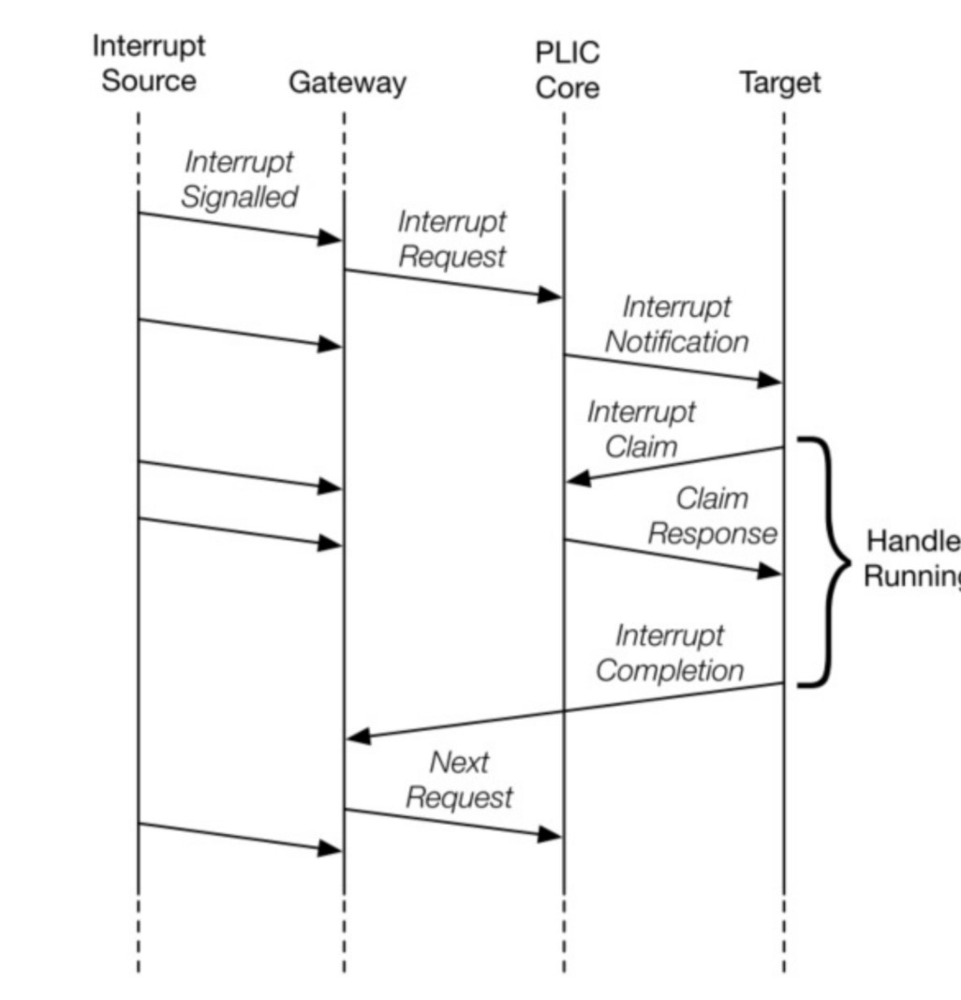

# RISC -V Interrupt

## CLINT

**Core Local Interrupter(CLINT)** 提供一个固定优先级的设计，仅对于来自更高特权级的中断提供抢占支持。`CLINT` 最初的设计是用来服务于 CPU 的软件和时钟中断，因为它不控制直接连接到 CPU 的其他本地中断。

有两种不同的 `CLINT` 模式的操作，`direct` 模式和 `vectored` 模式。为了配置 `CLINT` 模式，需要写 `mtvec.mode`；直接模式是 0 而向量模式是 1。直接模式是默认的 reset 值。`mtvec.base` 是这两种模式的触发中断和异常的基地址。

`mtvec.base` 的对齐要求如下所示：

- 对于直接模式要 4 字节对齐

- 对于向量模式要 4*XLEN 字节对齐

- 对于 `CLIC` 模式要 64 字节对齐

### CLINT 直接模式

直接模式意味着所有中断和异常都 trap 到同一个处理函数，没有实现向量表。软件负责执行代码并找出发生的是什么中断或异常。

### CLINT 向量模式

向量模式引入了一种创建向量表的方法，硬件使用该向量表降低终端处理延迟。当中断发生时，`pc` 寄存器将被硬件转移到向量中断表中断 ID 中的地址。 中断处理函数的偏移量使用 `mtvec.base + (mcause.code * 4)` 来计算。

## CLIC

**Core Local Interrupt Controller(CLIC)** 是一个功能齐全的本地中断控制器，并且支持可编程中断级和优先级配置。`CLIC` 还支持给定特权级别内的嵌套中断（抢占），基于中断级别和优先级配置。

`CLINT` 和 `CLIC` 都集成了寄存器 `mtime` 和 `mtimecmp` 来配置定时器中断，和 `msip` 触发软件中断。除此之外，`CLINT` 和 `CLIC` 都运行在 core 时钟频率上。

## Common Registers to CLIC and CLINT

- msip: M mode software interrupt pending register, 用于断言当前 CPU 的软件中断。

- mtime: 运行在特定频率上的 M mode 时钟寄存器。 `CLINT` 和 `CLIC` 设计中的一部分。在包含一个或多个 CPU 的设计中只有一个 `mtime` 寄存器。

- mtimecmp: 内存映射的 M mode timer compare register，当 `mtimecmp` 的值比 `mtime` 的值更大或者相等时来处罚一个时钟中断，每个 CPU 都有一个 `mtimecmp` 寄存器。

## PLIC(Platform Level Interrupt Controller)

PLIC 被用于管理所有全局中断并且将它们路由到一个或者多个 CPU core。对于 PLIC 来说它可能转发单个中断源到多个 CPU。在进入 PLIC 处理函数后，CPU 将会读 claim 寄存器获取中断 ID。一次成功的 claim 将会自动清除在 PLIC 中断 pending 寄存器中的 pending 位，向系统表示这个中断已经被服务。如果必要的话，在 PLIC 中断处理进程中在中断源中的 pending flag 应该也被清理。对于 CPU 来说尝试去 claim 一个中断甚至当 pending bit 没有被设置的时候也是合法的。这可能发生，举个例子来说，当一个全局的中断被路由到多个 CPU，并且一个 CPU 已经在另一个 CPU 尝试 claim 之前 claim 了这个中断。在使用 `mret/sret/uret` 指令退出 PLIC 处理函数之前，claim/complete 寄存器被写回处理程序入口获得的非零 claim/complete 值。

### Interrupt Flow

- 全局中断从源送到中断网关

- 中断网关然后向 PLIC core 发送单个中断请求，PLIC 将这些锁存在 peding bits(IP) 中。

- 如果这些目标开启了中断并且该中断优先级超过了 threshold（阈值），PLIC core 将会把中断标志转发给一个或者多个目标。

- 当目标接受外部中断的时候，他会送一个中断声明(**claim**)请求去取得 PLIC core 为该目标锁存的最高优先级的全局中断标识符。

- PLIC core 清除相应的中断源等待位。

- 在目标处理完中断后，它向合适的中断网关发送中断完成消息。

- 中断网关现在可以转发相同源的中断请求向 PLIC core。

### RISC -V PLIC Operation Parameters

- Interrupt Priorities registers

- Interrupt Pending Bits registers

- Interrupt Enables registers

- Interrupt Thresholds registers

- Interrupt Claim registers

- Interrupt Completion registers

### PLIC IDs, Priorities and Preemption

#### PLIC Thresholds

每个 CPU 都有一个 threshold 寄存器，这允许 PLIC 配置当中断优先级小于某个确定级别的时候会被进制。举例来说，如果 threshold 寄存器是 5 的话，表明中断优先级从 1 - 5 的中断都将不被允许。

#### PLIC Connectivity

根据本地终端选择，通过 PLIC 路由的全局中断以略微不同的方式连接到 CPU。如果 PLIC 与 CLINT 一起使用，则从 PLIC 路由的外部中断连接直接绑定到 C{U。如果 PLIC 与 CLIC 一起使用，则不使用外部中断连接，中断从 CLIC 接口进行路由。

## Reference

- [SiFive Interrupt Cookbook](https://starfivetech.com/uploads/sifive-interrupt-cookbook-v1p2.pdf)
